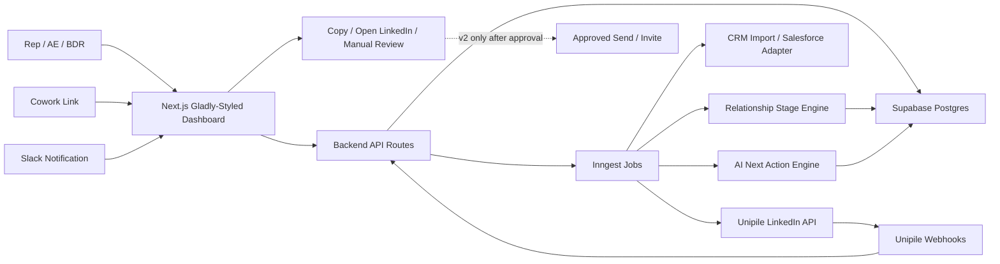
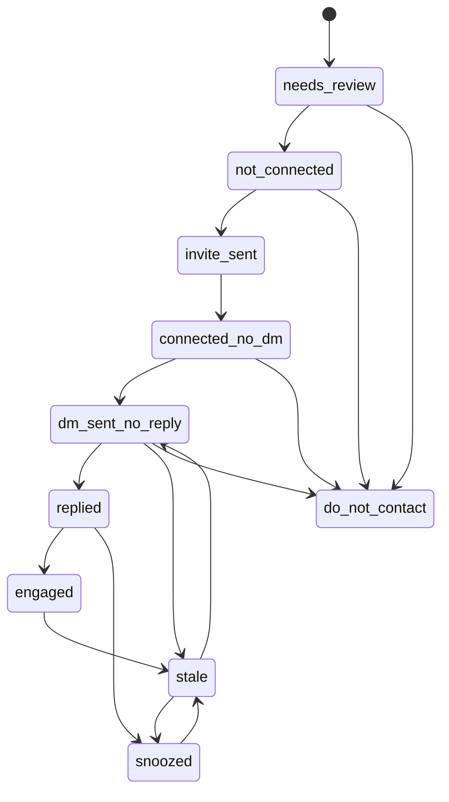

# feat: Build LinkedIn Relationship Tracker

## Overview

Build a production LinkedIn Relationship Tracker that turns the current Cowork Live Artifact into a durable CRM-style web app. The production system uses Postgres/Supabase as the system of record, Unipile for LinkedIn account connection, historical chat/message import, and webhooks, and a Gladly-styled Next.js dashboard for review workflows. Cowork and Slack remain entry points and notification surfaces, not the source of truth.

This is a greenfield repo. The plan assumes a new TypeScript app using Next.js App Router, Tailwind CSS, Supabase Postgres, Drizzle migrations, Inngest workers, and a small typed Unipile integration layer. If implementation discovers an existing platform preference, keep the domain boundaries in this plan and swap the framework-specific plumbing.

## Problem Frame

AE/BDR users need a daily LinkedIn relationship workflow that answers: who am I connected to, who is tied to target accounts, who has been messaged, who replied, who has gone stale, and what should I do next. The current artifact already has useful product framing: total connections, freshness buckets, search, filters, account/table views, manual refreshes, and a Save Responded action. Production must replace artifact memory with durable, computed state from imported LinkedIn activity and webhook updates.

The user explicitly wants the build framed by the existing spec and the Gladly UI design reference. The UI should therefore feel like a Gladly operational dashboard: mostly white and gray, Park green for primary actions and active states, light green table headers, compact table-first workflows, generous whitespace, lucide icons, and drawer/modal review surfaces.

## Requirements Trace

- R1. Persist reps, connected LinkedIn accounts, CRM accounts, people, relationships, chats, messages, webhook events, stage events, and next actions in Postgres.
- R2. Recreate the current artifact dashboard from database rows, including total connections and Fresh, Warm, Cooling, Stale, No Activity, Replies, Needs Action, and Needs Review counts.
- R3. Support manual import of current artifact data so the first dashboard can ship before Unipile sync is fully proven.
- R4. Use Unipile Hosted Auth to connect LinkedIn accounts, store the Unipile `account_id`, track account health, and prompt reconnect when needed.
- R5. Run historical sync because Unipile does not send old messages as new-message webhooks when an account is first connected.
- R6. Import paginated chats/messages idempotently, deduping on Unipile IDs and deriving inbound/outbound direction from sender/account identity.
- R7. Process Unipile messaging, new-relation, and account-status webhooks quickly, persist raw payloads, and process domain updates asynchronously.
- R8. Match LinkedIn people to CRM accounts/contacts using deterministic identifiers first, fuzzy matching second, and manual review below confidence thresholds.
- R9. Compute freshness buckets, relationship stages, reply detection, stage-change events, and next-action queue state from persisted relationship and message data.
- R10. Provide a Gladly-styled dashboard, account view, person drawer, reply queue, needs-action queue, needs-review queue, and manual controls such as Mark Responded, Snooze, Do Not Contact, Copy Message, and Open LinkedIn.
- R11. Generate AI next actions with explicit guardrails: no auto-send in v1, no messages for do-not-contact records, no fabricated account context, confidence-gated suggestions, and human review required.
- R12. Keep approved send/invite capabilities out of v1 and design them as a later gated phase with explicit approval, limits, audit logs, and kill switches.
- R13. Preserve platform-risk posture: do not use Cowork browser automation as the data source, and do not automate LinkedIn website activity in v1.
- R14. Include observability for sync health, webhook latency/failures, duplicate events, imported volume, relationship states, AI suggestions, and manual actions.
- R15. Enforce authenticated access and user/account ownership across dashboard data, sync actions, webhooks, manual overrides, and admin-only controls.

## Scope Boundaries

- The MVP is read-only LinkedIn relationship intelligence plus copy/open workflows. It must not auto-send LinkedIn DMs or invites.
- Cowork browser automation is not a data source for LinkedIn activity. Cowork can link to the app or review queue.
- Full Salesforce writeback, Outreach sequencing, and Cowork sequence orchestration are not required for the first production version.
- LinkedIn post engagement automation, comments, reactions, profile editing, and sequence automation are out of scope.
- Legal/security approval is a prerequisite for any v2 send/invite execution, even if the code path is technically straightforward.
- The plan does not require a specific deployment host, but assumes the selected host can run Next.js, receive public webhooks, execute workers, and connect to Supabase.

### Deferred to Separate Tasks

- Approved LinkedIn sends/invites: v2 task after security/legal review and after read-only sync has proven stable.
- Salesforce activity writeback and Outreach integration: future integration task after relationship state is trusted.
- Slack daily digest and Cowork deep links: post-MVP workflow task unless the first pilot requires them for adoption.

## Context & Research

### Relevant Code and Patterns

- No app code, manifests, git metadata, `docs/brainstorms`, or `docs/solutions` exist in this repo yet.
- No `AGENTS.md` exists inside this repo; the only active guidance is the user-provided instruction block and this planning skill.
- The build is greenfield, so file paths below describe intended output rather than modifications to existing patterns.
- Use the Gladly UI design reference supplied by the user as the visual system: Tailwind, Park green `#009b00`, Park light `#D8F4D8`, page background `#FAFAFA`, compact tables, pill search inputs, `rounded-md` buttons, lucide icons, drawer/modals, and mostly neutral UI.

### Institutional Learnings

- No `docs/solutions` directory exists, so there are no repository-local lessons to inherit.

### External References

- Unipile Getting Started confirms DSN plus access token setup and `X-API-KEY` usage: https://developer.unipile.com/docs/getting-started
- Unipile API Usage confirms cursor pagination and API key handling: https://developer.unipile.com/docs/api-usage
- Unipile Connection Methods recommends Hosted Auth, storing connected accounts, success/failure landing pages, reconnect handling, and account-status webhooks: https://developer.unipile.com/docs/connect-accounts
- Unipile Retrieving Messages confirms chat history retrieval, most-recent-first ordering, default limit 100, and pagination: https://developer.unipile.com/docs/get-messages
- Unipile List Chats and List Messages references confirm relevant filters, limits up to 250, and common error types: https://developer.unipile.com/reference/chatscontroller_listallchats and https://developer.unipile.com/reference/messagescontroller_listallmessages
- Unipile New Messages confirms sent and received webhook behavior, direction detection via sender/account comparison, and no old-message webhooks on first connection: https://developer.unipile.com/docs/new-messages-webhook
- Unipile Provider Limits recommends conservative LinkedIn usage, random spacing, profile retrieval caution, and no chat/message fetch limitation through synchronized inbox routes: https://developer.unipile.com/docs/provider-limits-and-restrictions
- Unipile Changelog shows active LinkedIn feature updates and no deprecation banner found during planning: https://developer.unipile.com/changelog
- LinkedIn Help prohibits third-party tools that scrape, modify, or automate activity on LinkedIn's website, which supports the read-only/copy-open MVP posture: https://www.linkedin.com/help/linkedin/answer/a1341387/prohibited-software-and-extensions

## Key Technical Decisions

- Use Postgres/Supabase as the system of record: relationship state must be durable, queryable, and independent of Cowork artifact memory.
- Use Unipile Hosted Auth for v1 account connection: it is the fastest supported connection path and avoids building custom authentication flows.
- Wrap Unipile behind `src/server/unipile`: this isolates API quirks, pagination, rate limits, error mapping, and future SDK changes from the domain layer.
- Use Inngest workers for sync/import/webhook processing: initial sync, partial sync, profile enrichment, matching, recompute, and AI generation are asynchronous and need retries/idempotency.
- Use Drizzle migrations against Supabase Postgres: the schema is central to the product, and migrations should live in repo with typed query boundaries.
- Use Supabase Auth plus server-side ownership checks as the v1 access boundary: the app handles user-linked message history and Unipile account state, so every dashboard query and action route must resolve the authenticated user before touching relationship data.
- Keep relationship computation deterministic before AI: freshness, stage, reply detection, and needs-review state should be reproducible from database facts.
- Treat AI as an advisory layer only: AI creates next-action suggestions and copyable messages, but policy-sensitive actions remain human-controlled.
- Use a manual import path before Unipile completion: the current artifact's 141-connection state can validate dashboard behavior while the Unipile POC proves message access and webhook reliability.
- Build UI with Gladly-styled custom components rather than generic themed components: the dashboard is an internal operational tool and should match the supplied Gladly admin/table patterns.
- Store raw webhook and Unipile payloads with processed status: raw payload retention supports audit, replay, and debugging while normalized tables power product queries.
- Gate all v2 send/invite paths behind explicit kill switches and audit logs: platform risk and LinkedIn limits make approval and controls part of the design, not an afterthought.

## Open Questions

### Resolved During Planning

- Should Cowork browser automation power the tracker? Resolved: no. Cowork is a launch/review surface; Postgres populated by Unipile is the source of truth.
- Should v1 send LinkedIn messages? Resolved: no. v1 supports copy/open only.
- Should the plan use the Gladly UI design reference? Resolved: yes. It should constrain color, layout, typography, component density, icons, and drawer/table patterns.
- Is this a greenfield or existing-app plan? Resolved: greenfield. The repo currently has no source files or manifests.
- Does the Unipile plan need both historical import and webhooks? Resolved: yes. Current docs confirm webhooks do not deliver old messages on initial connection.

### Deferred to Implementation

- Exact Unipile payload normalization fields: confirm during the 1-rep POC using real chat, attendee, profile, webhook, and sync payloads.
- Exact Salesforce auth mechanism and data source: use CSV/manual CRM import in the first slice unless Salesforce credentials and object mappings are available.
- Deployment target and worker runtime limits: choose during project setup based on the team environment, but preserve public webhook and background job requirements.
- Retention policy for message bodies: define with legal/security before wider rollout; implement the schema so retention/deletion can be added.
- Final SSO or enterprise identity provider: start with Supabase Auth-compatible user identity and keep `app_users` mapped so SSO can replace the login method later.
- AI provider/model choice: keep behind an internal service boundary and select based on existing company policy.

## Output Structure

    app/
      (auth)/
      (dashboard)/
        accounts/
        relationships/
        settings/
      api/
        linkedin/
        relationships/
        webhooks/
      layout.tsx
      page.tsx
    src/
      components/
        gladly/
        relationships/
        accounts/
      server/
        ai/
        auth/
        crm/
        dashboard/
        db/
        jobs/
        relationships/
        unipile/
        webhooks/
      styles/
    db/
      migrations/
      seed/
    inngest/
      functions/
    tests/
      api/
      components/
      integration/
      jobs/
      server/
    docs/
      plans/
      ops/

## High-Level Technical Design

> *This illustrates the intended approach and is directional guidance for review, not implementation specification. The implementing agent should treat it as context, not code to reproduce.*

## Implementation Units

- [x] **Unit 1: Greenfield App Foundation**

**Goal:** Establish the app shell, configuration, database access, worker runtime, and Gladly design tokens so all later work lands in a consistent structure.

**Requirements:** R1, R2, R10, R14

**Dependencies:** None

**Files:**
- Create: `package.json`
- Create: `tsconfig.json`
- Create: `next.config.ts`
- Create: `tailwind.config.ts`
- Create: `postcss.config.mjs`
- Create: `app/layout.tsx`
- Create: `app/page.tsx`
- Create: `src/styles/globals.css`
- Create: `src/components/gladly/button.tsx`
- Create: `src/components/gladly/input.tsx`
- Create: `src/components/gladly/table.tsx`
- Create: `src/components/gladly/badge.tsx`
- Create: `src/components/gladly/drawer.tsx`
- Create: `src/server/db/client.ts`
- Create: `src/server/config/env.ts`
- Create: `src/server/jobs/client.ts`
- Test: `tests/components/gladly-components.test.tsx`
- Test: `tests/server/env.test.ts`

**Approach:**
- Create a Next.js App Router TypeScript project with Tailwind and lucide icons.
- Encode Gladly color tokens as CSS variables and Tailwind extensions: Park green, Park hover, Park light, neutral grays, error, link, and page background.
- Build small UI primitives for buttons, inputs, table shells, badges, tabs, drawers, and cards using the supplied Gladly styles rather than adopting an off-brand theme.
- Add environment validation for Supabase, Unipile, Inngest, webhook secret, and AI provider variables without exposing secrets to client code.
- Create database and job clients as thin modules with no domain logic.

**Patterns to follow:**
- Gladly UI design reference: Tailwind-first styling, `#009b00` primary actions, `#D8F4D8` table headers, `#FAFAFA` page backgrounds, `rounded-md` buttons, `rounded-full` search, lucide icons.

**Test scenarios:**
- Happy path: rendering the app shell shows the dashboard route with no required data and no client-side secret exposure.
- Happy path: Gladly button variants render primary, secondary, ghost, and disabled states with the expected role/label behavior.
- Happy path: table header components apply the Gladly light green header treatment and preserve semantic table markup.
- Edge case: missing required server env var fails fast in server config validation with a clear variable name.
- Error path: client-side code cannot import server-only environment helpers.

**Verification:**
- The app can start with placeholder data, the visual primitives match the Gladly reference, and server-only configuration boundaries are enforced.

- [x] **Unit 2: Database Schema and Seed Import**

**Goal:** Create the persistent schema and a manual import path for current artifact data so the dashboard can be database-backed before Unipile is fully connected.

**Requirements:** R1, R2, R3, R9, R14

**Dependencies:** Unit 1

**Files:**
- Create: `db/migrations/0001_initial_relationship_tracker.sql`
- Create: `src/server/db/schema.ts`
- Create: `src/server/db/repositories/app-users.ts`
- Create: `src/server/db/repositories/linkedin-accounts.ts`
- Create: `src/server/db/repositories/relationships.ts`
- Create: `src/server/db/repositories/chats.ts`
- Create: `src/server/db/repositories/messages.ts`
- Create: `src/server/db/repositories/events.ts`
- Create: `src/server/import/artifact-import.ts`
- Create: `app/api/import/artifact/route.ts`
- Test: `tests/server/db/schema.test.ts`
- Test: `tests/integration/artifact-import.test.ts`

**Approach:**
- Implement tables from the spec with Postgres constraints for relationship status, relationship stage, freshness bucket, action type/status, and direction.
- Extend `app_users` with a unique Supabase auth identity field so login identity and application user records can be mapped without relying on mutable email alone.
- Add timestamps, unique constraints, and indexes for common dashboard and worker access paths: user/account, relationship stage, freshness bucket, last activity, Unipile IDs, webhook status, and person identifiers.
- Represent `crm_accounts`, `people`, and `account_people` as canonical matching surfaces independent of LinkedIn relationships.
- Store imported artifact rows with enough fields to compute dashboard counts and manual Save Responded behavior even before message history exists.
- Keep raw payload JSON on Unipile-backed tables for audit and replay, but keep normalized columns as dashboard query sources.

**Execution note:** Start with schema and repository tests before wiring UI queries, because all later behavior depends on durable constraints and idempotent upserts.

**Patterns to follow:**
- Use Drizzle schema definitions as the typed source alongside SQL migrations; avoid ad hoc SQL strings outside repository modules.

**Test scenarios:**
- Happy path: importing a 141-row artifact dataset creates people and relationships and returns dashboard counts that match Fresh/Warm/Cooling/Stale/No Activity inputs.
- Happy path: importing the same artifact dataset twice does not duplicate people, relationships, or account-person links.
- Happy path: marking imported rows as responded updates `manual_responded`, `has_replied`, relationship stage, and a relationship event.
- Happy path: authenticated identity maps to one `app_users` row through the auth identity field even if email casing changes.
- Edge case: a row with no activity date maps to `no_activity` and `needs_review` or `connected_no_dm` based on available status.
- Edge case: duplicate LinkedIn public identifiers across rows are merged into one person where safe and flagged for review where conflicting.
- Error path: invalid stage, bucket, or direction values fail validation before reaching the database.
- Integration: dashboard summary queries read from persisted rows, not in-memory fixtures.

**Verification:**
- A database-backed version of the current artifact can show the same core counts and persist manual response edits.

- [x] **Unit 3: Authentication and Access Boundaries**

**Goal:** Add authenticated user identity, app user provisioning, ownership checks, and admin boundaries before any third-party account or relationship data is exposed.

**Requirements:** R1, R4, R10, R12, R14, R15

**Dependencies:** Unit 1, Unit 2

**Files:**
- Create: `app/(auth)/login/page.tsx`
- Create: `app/(auth)/callback/route.ts`
- Create: `src/server/auth/session.ts`
- Create: `src/server/auth/app-user.ts`
- Create: `src/server/auth/permissions.ts`
- Create: `src/server/auth/ownership.ts`
- Create: `src/components/gladly/user-menu.tsx`
- Modify: `app/layout.tsx`
- Modify: `src/server/db/repositories/app-users.ts`
- Test: `tests/server/auth/session.test.ts`
- Test: `tests/server/auth/ownership.test.ts`
- Test: `tests/api/authenticated-route-access.test.ts`

**Approach:**
- Use Supabase Auth as the initial identity provider and map authenticated identities into `app_users`.
- Add server helpers that return the current app user, require authentication, require admin role, and verify ownership of LinkedIn accounts, relationships, next actions, and CRM account views.
- Route handlers should call these helpers before querying or mutating user-scoped data.
- Admin-only settings and future kill switches should require explicit admin role, not just a hidden UI route.
- Keep auth UI minimal and Gladly-styled: login, callback/error handling, and a compact user menu in the dashboard header.
- Where Supabase Row Level Security is practical, define policies that mirror server-side ownership checks; where service-role workers need bypass access, require worker-only server credentials.

**Execution note:** Add access-control tests before wiring Unipile connect/sync routes, because those routes create third-party account state.

**Patterns to follow:**
- Treat auth and ownership as server boundaries. UI hiding is only presentation; API routes and repositories must enforce access.

**Test scenarios:**
- Happy path: authenticated user is provisioned or loaded as an `app_users` row and can access their dashboard.
- Happy path: account owner can request a LinkedIn connect URL for their own user session.
- Happy path: admin user can access admin health and kill-switch routes.
- Edge case: authenticated non-owner cannot read another user's relationship detail, LinkedIn account, next action, or account map.
- Edge case: manager/admin access rules are explicit and tested rather than inferred from email domain.
- Error path: unauthenticated requests to dashboard APIs return unauthorized without leaking existence of records.
- Error path: worker-only service credentials are rejected from browser/session contexts.
- Integration: manual relationship action route resolves current user, verifies ownership, then writes the relationship event.

**Verification:**
- Every user-facing API path planned below has an auth/ownership strategy before third-party data is connected.

- [x] **Unit 4: Relationship Stage Engine**

**Goal:** Implement deterministic relationship computation for freshness, stage, reply status, last-touch fields, and stage-change events.

**Requirements:** R2, R6, R9, R10, R11

**Dependencies:** Unit 2, Unit 3

**Files:**
- Create: `src/server/relationships/freshness.ts`
- Create: `src/server/relationships/stage-engine.ts`
- Create: `src/server/relationships/recompute.ts`
- Create: `src/server/relationships/next-action-rules.ts`
- Create: `src/server/db/repositories/relationship-events.ts`
- Test: `tests/server/relationships/freshness.test.ts`
- Test: `tests/server/relationships/stage-engine.test.ts`
- Test: `tests/integration/relationship-recompute.test.ts`

**Approach:**
- Compute Fresh/Warm/Cooling/Stale/No Activity from `last_activity_at` using the artifact thresholds: 0-3, 4-7, 8-14, over 14 days, and null.
- Derive last inbound, last outbound, last activity, message preview, and `has_replied` from normalized messages and connection events.
- Stage transitions should prioritize do-not-contact and snooze before connection/message state.
- Write `stage_changed` events only when a recompute changes stage, with concise reason metadata.
- Keep rule-based next-action eligibility separate from AI copy generation so the app can queue work even when AI is unavailable.

**Patterns to follow:**
- Deterministic domain functions should be pure where possible, with database writes isolated in repository/recompute orchestration.

**Test scenarios:**
- Happy path: null last activity returns `no_activity`.
- Happy path: activity today, 6 days ago, 12 days ago, and 20 days ago maps to Fresh, Warm, Cooling, and Stale respectively.
- Happy path: connected person with zero messages becomes `connected_no_dm`.
- Happy path: outbound with no inbound becomes `dm_sent_no_reply`.
- Happy path: inbound after outbound becomes `replied`, and four or more total messages can become `engaged`.
- Edge case: inbound before latest outbound does not count as a reply to the latest outreach.
- Edge case: do-not-contact overrides all other stages.
- Edge case: snoozed-until in the future overrides normal stage; expired snooze does not.
- Error path: recompute for a missing relationship records a job failure without partial writes.
- Integration: inserting a new inbound message triggers recompute that updates relationship fields and inserts a stage event exactly once.

**Verification:**
- Relationship state is reproducible from persisted messages/events and does not depend on dashboard state.

- [x] **Unit 5: Unipile Account Connection and Client Wrapper**

**Goal:** Add Unipile configuration, Hosted Auth link generation, connection callback handling, account health storage, and a typed API wrapper.

**Requirements:** R4, R5, R6, R7, R13, R14

**Dependencies:** Unit 2, Unit 3

**Files:**
- Create: `src/server/unipile/client.ts`
- Create: `src/server/unipile/errors.ts`
- Create: `src/server/unipile/types.ts`
- Create: `src/server/unipile/pagination.ts`
- Create: `src/server/unipile/connection.ts`
- Create: `app/api/linkedin/connect-url/route.ts`
- Create: `app/api/linkedin/connection-callback/route.ts`
- Create: `app/linkedin/connected/page.tsx`
- Create: `app/linkedin/error/page.tsx`
- Create: `app/(dashboard)/settings/linkedin/page.tsx`
- Test: `tests/server/unipile/client.test.ts`
- Test: `tests/api/linkedin-connect-url.test.ts`
- Test: `tests/api/linkedin-callback.test.ts`

**Approach:**
- Validate Unipile DSN and API key only on the server; never expose the access token to browser code.
- Build methods for account connection, list chats, list messages, chat-message pagination, account resync, attendee/user profile lookup, and v2 send/start-chat methods behind disabled feature flags.
- Normalize Unipile errors into app-level categories: reconnect required, account restricted, retryable provider error, timeout, permission issue, and validation error.
- Implement Hosted Auth URL generation and callback handling with user/account ownership checks and idempotent `linkedin_accounts` upserts.
- Settings UI should show connected account health, last sync, reconnect-required state, and safe manual refresh actions.

**Execution note:** Use mocked Unipile responses and contract-shaped fixtures; do not require a real Unipile account for unit tests.

**Patterns to follow:**
- Keep all third-party request construction inside `src/server/unipile`.
- Use Unipile's cursor pagination contract consistently across chats/messages.

**Test scenarios:**
- Happy path: connect-url request for an authenticated user returns a Hosted Auth URL and does not persist an account yet.
- Happy path: successful callback upserts a LinkedIn account and enqueues initial sync.
- Happy path: Unipile list endpoints with cursors are requested until cursor is null.
- Edge case: reconnect callback for an existing `unipile_account_id` updates status without duplicating the account.
- Edge case: LinkedIn product selection defaults to `classic` when not provided.
- Error path: missing Unipile env vars fail server validation.
- Error path: Unipile `expired_credentials` maps to reconnect-required account state.
- Error path: Unipile 503/504 errors are marked retryable and do not mutate relationship state.
- Integration: settings page reflects account status transitions from pending to OK to reconnect required.
- Integration: non-owner cannot generate sync/connect actions for another user's LinkedIn account.

**Verification:**
- A user can initiate LinkedIn connection, return from Hosted Auth, and see a persisted account ready for sync.

- [x] **Unit 6: Historical Sync and Message Import Jobs**

**Goal:** Import historical LinkedIn chats/messages from Unipile, normalize people/chats/messages, and recompute affected relationships idempotently.

**Requirements:** R5, R6, R8, R9, R14

**Dependencies:** Unit 4, Unit 5

**Files:**
- Create: `inngest/functions/sync-linkedin-account-initial.ts`
- Create: `inngest/functions/sync-linkedin-account-partial.ts`
- Create: `inngest/functions/import-chat-messages.ts`
- Create: `src/server/jobs/linkedin-sync.ts`
- Create: `src/server/unipile/normalizers/chat.ts`
- Create: `src/server/unipile/normalizers/message.ts`
- Create: `src/server/unipile/normalizers/attendee.ts`
- Create: `src/server/relationships/person-upsert.ts`
- Create: `app/api/linkedin/accounts/[id]/sync/route.ts`
- Create: `app/api/linkedin/accounts/[id]/resync-full/route.ts`
- Test: `tests/jobs/sync-linkedin-account-initial.test.ts`
- Test: `tests/jobs/import-chat-messages.test.ts`
- Test: `tests/integration/linkedin-message-import.test.ts`

**Approach:**
- Initial sync calls Unipile account resync, waits or polls according to observed response behavior, lists chats with `account_id` and `account_type=LINKEDIN`, imports paginated messages for each chat, and recomputes affected relationships.
- Partial sync accepts an explicit time window, calls Unipile account sync with partial mode, fetches recent messages by account/time, and recomputes only affected people.
- Direction detection compares the linked account identity to the sender identity, with fallback to webhook fields if Unipile adds direct `is_sender` fields.
- Treat one-to-one LinkedIn chats as relationship-bearing and group chats as lower-confidence or needs-review until product requirements define group behavior.
- Use idempotency on `unipile_chat_id`, `unipile_message_id`, attendee provider IDs, and relationship user/person uniqueness.
- Do not call heavy profile sections by default; enrich only the minimal fields needed for matching and display.

**Patterns to follow:**
- Inngest functions should be small orchestration layers that call server modules and can be retried safely.
- Repository upserts should handle dedupe; jobs should not rely on "already processed" memory.

**Test scenarios:**
- Happy path: initial sync imports chats, messages, attendees, people, relationships, and updates `last_full_sync_at`.
- Happy path: paginated chat-message import keeps fetching until cursor is null and persists all pages.
- Happy path: re-running initial sync with the same Unipile payloads creates no duplicates.
- Happy path: outbound and inbound directions are assigned correctly from account/sender identity.
- Edge case: chat with missing attendee profile creates a needs-review person record with raw payload preserved.
- Edge case: group chat is imported but not auto-linked to a single person relationship without review.
- Edge case: a message with empty body but attachments still updates last activity and stores metadata.
- Error path: one failed chat import records a job error and allows the account sync to resume/retry without corrupting completed chats.
- Error path: Unipile account restriction pauses sync and marks the account for admin attention.
- Integration: imported inbound message after prior outbound changes dashboard reply count and relationship stage.

**Verification:**
- Historical manual LinkedIn messages become visible in the person drawer and dashboard last activity is computed from real message rows.

- [ ] **Unit 7: Webhook Ingestion and Async Processing**

**Goal:** Receive Unipile messaging, new-relation, and account-status webhooks safely, acknowledge quickly, persist raw events, and process domain changes asynchronously.

**Requirements:** R4, R6, R7, R9, R13, R14

**Dependencies:** Unit 4, Unit 5, Unit 6

**Files:**
- Create: `app/api/webhooks/unipile/messaging/route.ts`
- Create: `app/api/webhooks/unipile/users/route.ts`
- Create: `app/api/webhooks/unipile/account-status/route.ts`
- Create: `src/server/webhooks/unipile-auth.ts`
- Create: `src/server/webhooks/unipile-events.ts`
- Create: `inngest/functions/process-unipile-message-webhook.ts`
- Create: `inngest/functions/process-unipile-user-webhook.ts`
- Create: `inngest/functions/process-unipile-account-status-webhook.ts`
- Create: `src/server/notifications/reply-notifications.ts`
- Test: `tests/api/unipile-webhooks.test.ts`
- Test: `tests/jobs/process-unipile-message-webhook.test.ts`
- Test: `tests/jobs/process-unipile-account-status-webhook.test.ts`

**Approach:**
- Verify a custom webhook auth header before accepting payloads.
- Insert raw payloads into `unipile_webhook_events` with pending status and return HTTP 200 quickly.
- Process payloads in workers: upsert chat/message/person, determine direction, recompute relationship, mark replies, and enqueue notification events for inbound replies.
- Handle sent-message webhooks as outbound events; do not assume every `message_received` event is inbound.
- Account-status webhooks update account status, reconnect-required state, and job pause/resume behavior.
- New-relation webhook creates or updates the person and relationship as connected, then computes `connected_no_dm` when no messages exist.

**Patterns to follow:**
- Webhook route handlers should authenticate, persist, enqueue, and return; domain processing belongs in workers.
- Raw payload event status should move from pending to processed or failed with retryable metadata.

**Test scenarios:**
- Happy path: valid messaging webhook stores raw payload, returns 200, and enqueues processing.
- Happy path: inbound message after outbound marks relationship replied and queues a reply notification.
- Happy path: sent message webhook from the connected account records an outbound message, not an inbound reply.
- Happy path: new-relation webhook updates relationship status to connected and stage to connected_no_dm when no messages exist.
- Happy path: account status `CREDENTIALS` marks reconnect required and pauses sync jobs for that account.
- Edge case: duplicate webhook event does not duplicate messages or stage events.
- Edge case: webhook for unknown Unipile account is stored as failed with a clear reason.
- Error path: missing or invalid webhook auth header returns unauthorized and does not persist payload.
- Error path: worker failure leaves raw event replayable.
- Integration: webhook-to-dashboard latency path updates summary counts without manual refresh once processing completes.

**Verification:**
- New LinkedIn messages and account status changes update persisted state through replayable webhook events.

- [ ] **Unit 8: CRM Matching and Needs-Review Queue**

**Goal:** Match LinkedIn people to CRM accounts/contacts and expose ambiguous records for manual review.

**Requirements:** R8, R9, R10, R11

**Dependencies:** Unit 2, Unit 3, Unit 6

**Files:**
- Create: `src/server/crm/import.ts`
- Create: `src/server/crm/salesforce-adapter.ts`
- Create: `src/server/crm/matching.ts`
- Create: `src/server/crm/normalization.ts`
- Create: `app/api/crm/import/route.ts`
- Create: `app/api/relationships/[id]/match/route.ts`
- Create: `app/(dashboard)/relationships/needs-review/page.tsx`
- Create: `src/components/relationships/match-review-table.tsx`
- Create: `src/components/relationships/match-review-drawer.tsx`
- Test: `tests/server/crm/matching.test.ts`
- Test: `tests/integration/crm-import-and-match.test.ts`
- Test: `tests/components/match-review-table.test.tsx`

**Approach:**
- Start with CSV/manual CRM import and keep a Salesforce adapter boundary so real Salesforce sync can be added without rewriting matching.
- Normalize names, domains, company names, LinkedIn URLs, public identifiers, provider IDs, titles, and locations before matching.
- Apply matching priority from the spec: exact LinkedIn URL/public identifier/provider ID, then exact name/company, then fuzzy name/company, then title/location, then manual review.
- Auto-link when confidence is at least 75 and evidence is deterministic enough; below threshold create a Needs Review item.
- Manual review actions should confirm match, create person/account link, ignore, snooze, or do-not-contact with audit events.

**Patterns to follow:**
- Keep confidence scoring explainable; store match source, confidence, and reason metadata for user trust and debugging.

**Test scenarios:**
- Happy path: exact Salesforce LinkedIn URL match auto-links at confidence 100.
- Happy path: exact public identifier match auto-links at confidence 95.
- Happy path: full name plus exact company match auto-links at confidence 85.
- Happy path: fuzzy name plus normalized company match above threshold creates account-person link with confidence metadata.
- Edge case: same full name across two possible accounts falls below auto-link threshold and appears in Needs Review.
- Edge case: missing company but matching title/location does not auto-link above safe confidence.
- Error path: malformed CRM import row is rejected with row-level error without rolling back valid rows.
- Integration: confirming a suggested match in the UI updates account view coverage and relationship row account display.

**Verification:**
- Known contacts can be matched automatically, ambiguous contacts are reviewable, and match decisions are auditable.

- [ ] **Unit 9: Dashboard, Account View, and Person Drawer**

**Goal:** Build the Gladly-styled user workflow: summary metrics, filters, table/account views, queues, person drawer, message history, and manual actions.

**Requirements:** R2, R3, R9, R10, R11, R13

**Dependencies:** Unit 2, Unit 3, Unit 4, Unit 8

**Files:**
- Create: `src/server/dashboard/summary.ts`
- Create: `src/server/dashboard/relationships-query.ts`
- Create: `src/server/dashboard/accounts-query.ts`
- Create: `app/(dashboard)/relationships/page.tsx`
- Create: `app/(dashboard)/accounts/page.tsx`
- Create: `app/(dashboard)/accounts/[id]/page.tsx`
- Create: `app/api/relationships/summary/route.ts`
- Create: `app/api/relationships/route.ts`
- Create: `app/api/accounts/[id]/linkedin-map/route.ts`
- Create: `app/api/relationships/[id]/route.ts`
- Create: `app/api/relationships/[id]/mark-responded/route.ts`
- Create: `app/api/relationships/[id]/snooze/route.ts`
- Create: `app/api/relationships/[id]/do-not-contact/route.ts`
- Create: `src/components/relationships/summary-cards.tsx`
- Create: `src/components/relationships/relationship-filters.tsx`
- Create: `src/components/relationships/relationship-table.tsx`
- Create: `src/components/relationships/person-drawer.tsx`
- Create: `src/components/accounts/account-map.tsx`
- Test: `tests/server/dashboard/relationships-query.test.ts`
- Test: `tests/api/relationship-actions.test.ts`
- Test: `tests/components/relationship-table.test.tsx`
- Test: `tests/components/person-drawer.test.tsx`
- Test: `tests/integration/dashboard-workflow.test.ts`

**Approach:**
- Use the current artifact mental model: header count, data-as-of timestamp, Refresh Connections, Refresh Activity, Export, Settings, metric cards, search, bucket filters, table and account views.
- Use Gladly UI constraints: light page background, white bordered content cards, light green table headers, pill search, green active tabs, compact rows, Park green primary actions, external-link icon for LinkedIn profile links.
- Keep table as the primary surface for repeated daily work; use account cards only for account-level summaries and repeated account items.
- Person drawer should include profile, relationship state, last 5-10 messages, AI next action, copy/open controls, manual overrides, and audit timeline.
- Manual actions update persisted relationship state and insert events.
- All route handlers and server queries should scope by authenticated app user, with admin-only exceptions isolated to admin settings.
- Refresh buttons enqueue jobs and show job state, not synchronous long-running API calls.

**Patterns to follow:**
- Gladly Liveboards/table layouts for dense dashboard surfaces.
- Gladly conversation/profile three-column patterns adapted as a right-side person drawer.

**Test scenarios:**
- Happy path: dashboard summary displays total, bucket counts, replies, needs action, needs review, and data-as-of from database queries.
- Happy path: search by name, account, title, and location filters relationship rows.
- Happy path: bucket and stage filters combine predictably and preserve selected view state.
- Happy path: account view shows connected, no DM, DM sent/no reply, replied, and stale counts.
- Happy path: opening a relationship shows person profile, match, relationship state, recent messages, next action, and audit events.
- Happy path: Mark Responded sets manual response fields, stage, and event, then updates visible counts.
- Edge case: empty result set shows a Gladly-style empty state with no broken table layout.
- Edge case: long names, titles, locations, and suggested actions wrap or truncate without overlapping controls.
- Edge case: no LinkedIn URL disables Open LinkedIn and explains why in the drawer.
- Error path: failed manual action shows an inline error and does not optimistically leave stale UI state.
- Error path: authenticated user attempting to open another user's relationship receives not found or forbidden without record details.
- Integration: Refresh Activity enqueues a partial sync job and returns a job identifier/status visible in the UI.

**Verification:**
- A rep can run the daily follow-up workflow from the dashboard without Cowork recrawling LinkedIn.

- [ ] **Unit 10: AI Next Actions and Human Review Workflow**

**Goal:** Generate guarded, explainable next actions and suggested messages for daily follow-up while keeping humans in control.

**Requirements:** R9, R10, R11, R12, R13, R14

**Dependencies:** Unit 3, Unit 4, Unit 9

**Files:**
- Create: `src/server/ai/provider.ts`
- Create: `src/server/ai/next-action-context.ts`
- Create: `src/server/ai/next-action-generator.ts`
- Create: `src/server/ai/guardrails.ts`
- Create: `inngest/functions/generate-next-action.ts`
- Create: `app/api/relationships/[id]/generate-next-action/route.ts`
- Create: `app/api/next-actions/[id]/copy/route.ts`
- Create: `app/api/next-actions/[id]/dismiss/route.ts`
- Create: `src/components/relationships/next-action-panel.tsx`
- Test: `tests/server/ai/guardrails.test.ts`
- Test: `tests/server/ai/next-action-context.test.ts`
- Test: `tests/jobs/generate-next-action.test.ts`
- Test: `tests/api/next-action-actions.test.ts`

**Approach:**
- Build a context assembler that includes rep, account, person, relationship state, recent messages, and playbook rules.
- Apply deterministic pre-checks before AI: do-not-contact, snoozed, cooldown, max follow-ups, weak context, sensitive state, and no eligible action.
- Ask AI for structured action type, priority, reason, suggested message, confidence, and human-review requirement.
- Validate AI output against allowed actions and guardrails before persisting.
- Copy and dismiss actions should update `next_actions.status` and relationship events for audit.
- Keep `approve send` UI hidden or disabled in v1 with explanatory admin-gated copy only if product wants visible v2 affordance.

**Patterns to follow:**
- Treat AI output as untrusted data that must be validated and policy-checked before display.

**Test scenarios:**
- Happy path: stale high-priority relationship with prior outbound generates a follow-up action with reason and suggested message.
- Happy path: connected-no-DM relationship generates a first-DM suggestion when eligible.
- Happy path: low-confidence output persists an Open LinkedIn/manual review action rather than a specific message.
- Edge case: do-not-contact relationship generates no AI message and records skipped reason.
- Edge case: snoozed relationship before `snoozed_until` generates no pending action.
- Edge case: weak account context produces a low-specificity message and does not fabricate news.
- Error path: malformed AI response is rejected and logged without creating a pending action.
- Error path: AI provider timeout leaves relationship usable and records a retryable generation failure.
- Integration: Copy action changes next-action status to copied and inserts an audit event.

**Verification:**
- The dashboard can show useful next-action recommendations without any automatic LinkedIn send behavior.

- [ ] **Unit 11: Observability, Admin Controls, and V2 Send Readiness**

**Goal:** Add operational visibility, safety controls, and dormant approved-send/invite design surfaces for post-MVP rollout.

**Requirements:** R12, R13, R14

**Dependencies:** Unit 3, Unit 5, Unit 6, Unit 7, Unit 10

**Files:**
- Create: `src/server/observability/metrics.ts`
- Create: `src/server/observability/logging.ts`
- Create: `src/server/safety/kill-switches.ts`
- Create: `src/server/safety/rate-limits.ts`
- Create: `src/server/safety/audit.ts`
- Create: `app/(dashboard)/settings/admin/page.tsx`
- Create: `app/api/admin/health/route.ts`
- Create: `app/api/admin/kill-switches/route.ts`
- Create: `docs/ops/unipile-poc-checklist.md`
- Create: `docs/ops/linkedin-risk-controls.md`
- Test: `tests/server/safety/kill-switches.test.ts`
- Test: `tests/server/safety/rate-limits.test.ts`
- Test: `tests/api/admin-health.test.ts`

**Approach:**
- Track metrics from the spec: connected accounts, account health, sync duration, chats/messages imported, webhook latency/errors, duplicates, relationships by stage, AI actions, copied messages, reply detection, and Unipile restrictions/errors.
- Add structured logs to workers with job ID, user ID, LinkedIn account ID, Unipile account ID, operation, status, and duration.
- Add global/user/account/action kill-switch records even before v2 send is enabled.
- Admin controls must require admin permissions server-side and should never rely on route obscurity.
- Document the 1-rep Unipile POC checklist and pass/fail criteria in repo so implementation can validate real field availability before broad buildout.
- For v2 readiness, keep send/invite methods wrapped in disabled server-side feature flags with no visible production path until legal/security approval.

**Patterns to follow:**
- Safety controls should live server-side and be checked before any external action, not only hidden in the UI.

**Test scenarios:**
- Happy path: admin health endpoint reports account sync health, webhook backlog, and recent failed jobs.
- Happy path: global LinkedIn action kill switch blocks dormant send/invite service calls.
- Happy path: per-account restriction disables actions for only that LinkedIn account.
- Edge case: missing metrics backend degrades to structured logs without breaking user workflows.
- Edge case: rate-limit counters reset by configured day/week windows.
- Error path: attempted v2 send while disabled records a blocked audit event and does not call Unipile.
- Error path: non-admin request to kill-switch routes is denied and audited.
- Integration: a sync job emits structured success/failure logs and metrics with the required identifiers.

**Verification:**
- Operators can see sync/webhook health, replay failures, and enforce safety controls before enabling broader rollout.

## System-Wide Impact

- **Interaction graph:** Authenticated dashboard actions enqueue jobs; Unipile webhooks enqueue workers; workers update relationships and events; relationship recompute updates dashboard summaries; AI generation reads relationship context and writes next actions.
- **Error propagation:** Third-party errors map to account health, retryable job status, or user/admin-facing reconnect/restricted states. UI actions should show actionable errors while raw worker failures stay replayable.
- **State lifecycle risks:** Historical sync, partial sync, webhooks, manual import, and manual overrides can all touch the same relationships. Upserts, unique constraints, and recompute-from-facts reduce duplicate and ordering risk.
- **API surface parity:** Dashboard pages and API routes must use the same repository/query modules so table, account, drawer, and queue views do not drift.
- **Integration coverage:** Webhook-to-message-to-recompute-to-dashboard and import-to-match-to-account-view are the critical cross-layer scenarios unit tests alone will not prove.
- **Unchanged invariants:** v1 never sends LinkedIn messages or invitations through Unipile, never uses Cowork browser automation as a data source, never stores Unipile API keys in client-side code, and never exposes user-scoped relationship data without authenticated ownership checks.

## Flow and Edge-Case Analysis

### Primary User Flows

1. Rep imports artifact data, opens dashboard, filters stale/no-reply relationships, opens a drawer, copies a suggested message, and opens LinkedIn manually.
2. Rep connects LinkedIn through Hosted Auth, returns to the app, initial sync imports historical chats/messages, and dashboard counts become computed from message data.
3. Unipile sends a new-message webhook, the app stores and processes it, relationship state updates, and the rep sees the reply in the dashboard/notification surface.
4. A LinkedIn attendee cannot be confidently matched to CRM data, so the record appears in Needs Review for confirm/create/ignore/do-not-contact.
5. Account status changes to reconnect-required, sync pauses, the settings page prompts reconnect, and partial sync resumes after account health returns to OK.

### Important Gaps Addressed by the Plan

- Historical messages are not delivered as initial webhooks, so Unit 6 explicitly imports history before relying on Unit 7 webhooks.
- Sent-message webhooks can represent outbound manual LinkedIn activity, so Unit 7 direction detection treats `message_received` as direction-neutral until sender/account identity is checked.
- Manual artifact data and Unipile data may overlap, so Unit 2 and Unit 6 require idempotent upserts and recompute-from-facts behavior.
- LinkedIn platform risk is real, so v1 excludes send/invite, Unit 11 adds kill switches, and v2 is deferred to separate approval.
- CRM matching can create bad account maps if overconfident, so Unit 8 stores confidence/reasons and routes ambiguous matches to human review.

## Risks & Dependencies

| Risk | Mitigation |
|------|------------|
| Unipile payloads differ from examples or omit needed fields | Run the documented 1-rep POC first; keep raw payloads; isolate normalizers; defer exact field mapping to implementation where real payloads are available. |
| LinkedIn account restrictions or terms risk | Keep v1 read-only/copy-open; add account health states, kill switches, conservative limits, and legal/security approval before v2. |
| Historical sync creates duplicates or inconsistent relationship state | Use unique Unipile IDs, idempotent upserts, and deterministic recompute after imports/webhooks. |
| Message imports expose sensitive data | Minimize displayed fields, keep retention policy deferred to legal/security, and design schema so deletion/redaction can be added. |
| CRM matching links people to the wrong account | Use deterministic matches first, confidence thresholds, explainable reasons, and manual review below threshold. |
| AI suggests inaccurate or risky outreach | Validate structured output, enforce guardrails, avoid fabricated account news, require human review, and never auto-send in v1. |
| Long-running sync exceeds web request limits | Use workers for sync/import/recompute and keep API routes as enqueue/status surfaces. |
| Empty repo leads to framework churn | Make the architecture boundaries explicit; if team standard differs, preserve boundaries while replacing framework details. |

## Success Metrics

- Current artifact data can be imported and recreated from database rows with matching total and freshness bucket counts.
- One pilot rep can connect LinkedIn and import historical chats/messages for known conversations.
- New inbound LinkedIn message updates relationship state within 60 seconds after webhook processing.
- Known contacts/accounts match automatically at 80% or better during the pilot, with ambiguous cases in Needs Review.
- Daily dashboard workflow can identify replies, no-DM connections, no-reply follow-ups, stale relationships, and weak account coverage without recrawling LinkedIn.
- No LinkedIn send or invite occurs from v1 production code.

## Phased Delivery

### Phase 0: POC Validation

- Create Unipile account, connect one LinkedIn account, trigger sync, inspect 10 known chats, validate direction, profile/attendee IDs, webhook delivery, and accepted relation behavior.
- Record findings in `docs/ops/unipile-poc-checklist.md`.

### Phase 1: Database-Backed Artifact Replacement

- Deliver Units 1-4 and the artifact import subset of Unit 9.
- Acceptance: dashboard counts and manual Save Responded persist from database rows.

### Phase 2: Unipile Historical Sync

- Deliver Units 5-6.
- Acceptance: old manual LinkedIn messages appear in person drawer and last activity is computed from imported messages.

### Phase 3: Matching, Webhooks, and Daily Workflow

- Deliver Units 7-9.
- Acceptance: replies update through webhooks, account view reflects matched relationships, and ambiguous matches are reviewable.

### Phase 4: AI Next Actions and Operations

- Deliver Units 10-11.
- Acceptance: AI suggestions are copyable and guarded; operators can inspect sync/webhook health and enforce safety controls.

### Phase 5: Approved Sending Readiness

- Separate future task after legal/security review.
- Acceptance: every outbound action requires explicit approval, rate limits are enforced, all sends are audited, and admin can disable all LinkedIn actions instantly.

## Documentation / Operational Notes

- Add `docs/ops/unipile-poc-checklist.md` before broader buildout so real Unipile payload assumptions are recorded.
- Add `docs/ops/linkedin-risk-controls.md` before any pilot with customer or prospect data.
- Document environment variables and secret handling in the README during Unit 1.
- Document manual import format during Unit 2 so current artifact data can be reloaded safely.
- Add a short UI style guide or component gallery page during Unit 1 or Unit 9 to preserve Gladly design consistency.

## Sources & References

- Origin input: user-provided LinkedIn Relationship Tracker engineering spec in this thread.
- Design input: Gladly UI Design reference supplied by the user.
- Unipile Getting Started: https://developer.unipile.com/docs/getting-started
- Unipile API Usage: https://developer.unipile.com/docs/api-usage
- Unipile Connection Methods: https://developer.unipile.com/docs/connect-accounts
- Unipile Retrieving Messages: https://developer.unipile.com/docs/get-messages
- Unipile List Chats: https://developer.unipile.com/reference/chatscontroller_listallchats
- Unipile List Messages: https://developer.unipile.com/reference/messagescontroller_listallmessages
- Unipile New Messages Webhook: https://developer.unipile.com/docs/new-messages-webhook
- Unipile Provider Limits and Restrictions: https://developer.unipile.com/docs/provider-limits-and-restrictions
- Unipile Changelog: https://developer.unipile.com/changelog
- LinkedIn Prohibited Software and Extensions: https://www.linkedin.com/help/linkedin/answer/a1341387/prohibited-software-and-extensions
