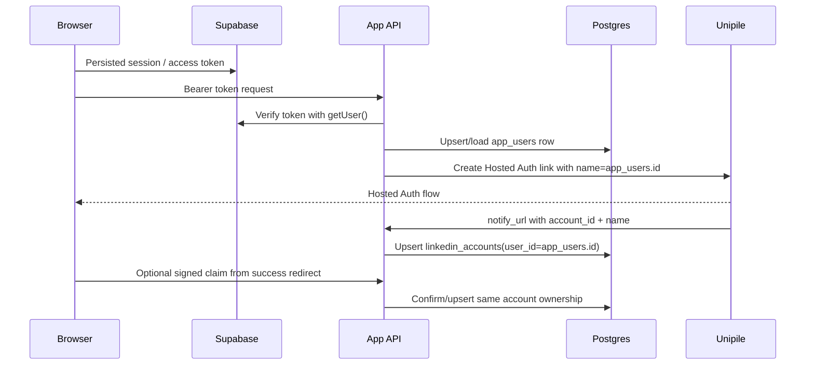

# fix: Persist LinkedIn auth to the signed-in user

## Overview

Replace the remaining demo identity surfaces with the authenticated user and ensure LinkedIn Hosted Auth persists against that user's durable `app_users` row. The target outcome is: a user signs in with Supabase, opens LinkedIn settings, connects LinkedIn through Unipile, and sees that connection persist to their own account across reloads and later sessions.

## Problem Frame

The app currently has two related gaps. First, production UI still renders demo auth data such as "Daniel Torres" and a `DT` avatar in user-facing screens. Second, the auth and LinkedIn paths need a stricter ownership bridge: Supabase returns an auth identity, while the app schema stores application users in `app_users` and LinkedIn accounts reference `linkedin_accounts.user_id -> app_users.id`. If the connect/callback paths use a transient or demo identity instead of the current `app_users.id`, LinkedIn connections can look successful in Unipile but fail to appear as persistent state for the real signed-in user.

## Requirements Trace

- R1. Remove hard-coded demo user identity from production UI surfaces.
- R2. Provision or load an `app_users` row for the authenticated Supabase user before creating or claiming LinkedIn connections.
- R3. Store `linkedin_accounts.user_id` as the current app user's `app_users.id`, not a display fixture or test identity.
- R4. Show the current user's actual name/email/initials and LinkedIn account status on the settings page.
- R5. Preserve the existing Unipile Hosted Auth behavior: generate a hosted link, receive `account_id`, persist the account, and queue initial sync.
- R6. Keep ownership boundaries server-enforced; UI state must not be the only protection.

## Scope Boundaries

- Do not replace the whole dashboard relationship dataset in this fix unless a value is explicitly auth/user chrome.
- Do not add LinkedIn send/invite automation.
- Do not weaken Hosted Auth account claiming by allowing arbitrary `account_id` claims without a signed user-bound token or backend callback proof.
- Do not introduce a new authentication provider.

### Deferred to Separate Tasks

- Full dashboard data replacement: replace placeholder relationship metrics and rows in a separate data-backed dashboard plan.
- Cookie-based SSR auth migration: optional future hardening if server-rendered dashboard personalization becomes necessary.

## Context & Research

### Relevant Code and Patterns

- `src/client/supabase.ts` already enables browser session persistence with `persistSession: true` and `autoRefreshToken: true`.
- `src/server/auth/request-session.ts` verifies bearer tokens with Supabase and returns the authenticated identity.
- `src/server/db/repositories/app-users.ts` has `upsertAppUserFromIdentity`, but authenticated API routes do not consistently use it before LinkedIn ownership writes.
- `src/server/db/repositories/linkedin-accounts.ts` persists LinkedIn accounts and updates ownership on `unipile_account_id` conflict.
- `app/api/linkedin/connect-url/route.ts` creates Unipile Hosted Auth links for the current bearer-authenticated user.
- `src/server/linkedin/connection-callback.ts` handles Unipile `notify_url` callbacks and queues initial sync.
- `app/(dashboard)/settings/linkedin/page.tsx` currently hard-codes "Daniel Torres", "No live account status yet", and a pending badge.
- `app/page.tsx` currently hard-codes a `DT` avatar in the dashboard header.

### Institutional Learnings

- No `docs/solutions/` entries exist in this repo.

### External References

- Supabase JavaScript auth docs state browser clients persist sessions by default and can use `persistSession` with storage-backed sessions: https://supabase.com/docs/reference/javascript/auth-api
- Supabase `getSession` docs warn that server trust decisions should use `getUser()` rather than trusting stored session values directly: https://supabase.com/docs/reference/javascript/auth-getsession
- Supabase Next.js docs recommend cookie-based auth for server-rendered personalization, but the current app already uses bearer-token API routes from client components: https://supabase.com/docs/guides/auth/quickstarts/nextjs
- Unipile Hosted Auth docs recommend using `name` as the internal user ID and `notify_url` to match connected accounts back to users: https://developer.unipile.com/docs/hosted-auth
- Unipile connection-methods docs describe storing connected account IDs linked to the application's user ID: https://developer.unipile.com/docs/connect-accounts

## Key Technical Decisions

- Use `app_users.id` as the internal Unipile `name` value and LinkedIn account owner key: this matches the schema foreign key and makes account persistence independent from mutable display data.
- Add a reusable authenticated app-user resolver rather than duplicating app-user upsert logic in every route: this keeps identity provisioning consistent across connect URL, claim, import, and sync actions.
- Keep browser session persistence in the Supabase client: the current implementation is compatible with this workflow as long as the user stays on the canonical app origin.
- Fetch user/account status from an authenticated API for client-rendered settings: this matches the existing bearer-token route pattern and avoids a larger SSR-cookie migration in this fix.
- Keep tests free to use fake people such as Daniel Torres where they are fixtures; the production UI and persistence paths are the cleanup target.

## Open Questions

### Resolved During Planning

- Should the app rely on Unipile's backend callback only? No. The callback is important, but an authenticated browser return path with a signed user-bound claim gives a second safe persistence path for the user who just connected.
- Should the settings page keep demo fallback text? No. It should show the current signed-in user or a clear sign-in required state.
- Should `linkedin_accounts.user_id` use Supabase auth user ID directly? No. The schema references `app_users.id`; routes should provision/load the app user and use that ID.

### Deferred to Implementation

- Exact display copy for a user whose Supabase profile has no full name: fall back to email-derived labels during implementation.
- Exact one-time production cleanup method: depends on current production rows and should be verified against the live database before deleting or reassigning anything.

## High-Level Technical Design

> *This illustrates the intended approach and is directional guidance for review, not implementation specification. The implementing agent should treat it as context, not code to reproduce.*

## Implementation Units

- [x] **Unit 1: Add authenticated app-user resolution**

**Goal:** Convert a verified Supabase auth identity into a durable `app_users` record before any user-owned data writes occur.

**Requirements:** R2, R3, R6

**Dependencies:** None

**Files:**
- Create: `src/server/auth/request-app-user.ts`
- Modify: `src/server/db/repositories/app-users.ts`
- Test: `tests/server/auth/session.test.ts`
- Test: `tests/api/authenticated-route-access.test.ts`

**Approach:**
- Add a helper that verifies the bearer token through the existing Supabase `getUser()` path, then calls `upsertAppUserFromIdentity`.
- Return both the auth identity and the app-user record when a route needs both concepts.
- Keep `authUserId` and `appUser.id` semantically distinct in naming so future code does not accidentally reintroduce the mismatch.

**Patterns to follow:**
- `src/server/auth/request-session.ts` for bearer extraction and Supabase verification.
- `src/server/db/repositories/app-users.ts` for upsert behavior and email normalization.

**Test scenarios:**
- Happy path: verified Supabase user creates or updates one `app_users` row and returns its `id`.
- Edge case: changed email casing updates `app_users.email` without changing the app-user owner ID.
- Error path: missing or invalid bearer token does not call the app-user upsert store.
- Integration: a route helper caller receives an app user suitable for `linkedin_accounts.user_id`.

**Verification:**
- Authenticated route helpers consistently expose a durable app user before user-owned writes.

- [x] **Unit 2: Use app-user identity in LinkedIn connect and claim paths**

**Goal:** Ensure Unipile Hosted Auth and account persistence use the current `app_users.id` as the internal user key.

**Requirements:** R2, R3, R5, R6

**Dependencies:** Unit 1

**Files:**
- Modify: `app/api/linkedin/connect-url/route.ts`
- Modify: `app/api/linkedin/claim-connected-account/route.ts`
- Modify: `src/server/linkedin/claim-connected-account.ts`
- Modify: `src/server/linkedin/connection-callback.ts`
- Modify: `src/server/unipile/connection.ts`
- Test: `tests/api/linkedin-connect-url.test.ts`
- Test: `tests/api/linkedin-callback.test.ts`

**Approach:**
- Generate Hosted Auth links after resolving the app user, not just the Supabase identity.
- Send `name=app_users.id` to Unipile so `notify_url` can upsert the account against the correct FK target.
- Bind any success-redirect claim token to the app-user ID and verify the signed token before accepting an `account_id` from the browser return path.
- Keep webhook/callback persistence as the primary backend path and the authenticated browser claim as a safe repair/confirmation path.

**Patterns to follow:**
- Current `buildHostedAuthLinkInput` Hosted Auth payload construction.
- Current `upsertLinkedInAccountFromHostedAuth` conflict behavior on `unipile_account_id`.

**Test scenarios:**
- Happy path: connect URL payload contains `name` equal to the app-user ID and success redirect contains a signed claim token.
- Happy path: Unipile callback with `account_id` and `name=app_user_id` upserts `linkedin_accounts.user_id=app_user_id` and queues initial sync.
- Happy path: authenticated connected-page claim verifies the token and upserts the account for the same app user.
- Error path: claim token for user A cannot be used by signed-in user B.
- Error path: invalid or expired claim token does not call Unipile or mutate LinkedIn account ownership.

**Verification:**
- New LinkedIn connections persist to the signed-in user's app account and survive refresh/re-login.

- [x] **Unit 3: Add current user and LinkedIn account status API**

**Goal:** Provide the settings and dashboard UI with real authenticated user/account state instead of demo identity data.

**Requirements:** R1, R4, R6

**Dependencies:** Unit 1

**Files:**
- Create: `app/api/me/route.ts`
- Modify: `src/server/db/repositories/linkedin-accounts.ts`
- Test: `tests/api/current-user-status.test.ts`
- Test: `tests/api/authenticated-route-access.test.ts`

**Approach:**
- Add a route that resolves the current app user and returns safe profile fields: display name, email, initials, role, and LinkedIn account status summary.
- Add a repository query for the current user's LinkedIn accounts, ordered by update time or created time.
- Return only records owned by the resolved app user.

**Patterns to follow:**
- Existing API routes returning `NextResponse.json`.
- Existing ownership checks in `src/server/auth/ownership.ts`.

**Test scenarios:**
- Happy path: signed-in user with an OK LinkedIn account receives active/connected status.
- Happy path: signed-in user with no LinkedIn account receives a connectable empty state.
- Edge case: user with `reconnectRequired=true` receives a reconnect state.
- Error path: unauthenticated request returns 401.
- Integration: API never returns another user's LinkedIn account.

**Verification:**
- The UI has one authoritative endpoint for real user/account state.

- [x] **Unit 4: Replace demo identity UI with authenticated state**

**Goal:** Remove "Daniel Torres", `DT`, and static pending account text from production screens.

**Requirements:** R1, R4

**Dependencies:** Unit 3

**Files:**
- Modify: `app/(dashboard)/settings/linkedin/page.tsx`
- Modify: `app/page.tsx`
- Create: `src/components/auth/authenticated-user-summary.tsx`
- Modify: `src/components/gladly/user-menu.tsx`
- Test: `tests/components/authenticated-user-summary.test.tsx`

**Approach:**
- Move settings account status into a client component that reads the persisted Supabase session, calls `app/api/me/route.ts`, and renders real state.
- Derive initials from the authenticated user's name or email instead of hard-coding `DT`.
- Replace "No live account status yet" with states driven by the API: not connected, connected, reconnect required, or loading/error.
- Keep unauthenticated users directed to `/login?next=/settings/linkedin`.

**Patterns to follow:**
- `src/components/linkedin/linkedin-connect-button.tsx` for browser Supabase session handling.
- Existing Gladly button/badge primitives.

**Test scenarios:**
- Happy path: user with full name "Nate Larkin" renders `Nate Larkin` and `NL`.
- Happy path: user without full name renders their email and email-derived initials.
- Happy path: connected LinkedIn account renders an active/connected badge and avoids showing the connect prompt as the primary state.
- Edge case: no account renders a connect prompt without any demo user name.
- Error path: expired session renders sign-in required messaging and route.

**Verification:**
- No production UI path displays Daniel/Danny Torres or a hard-coded `DT` as the authenticated user.

- [x] **Unit 5: Plan and execute production demo-data cleanup**

**Goal:** Remove or repair any existing production rows created under demo/test identity assumptions without losing the real user's connected LinkedIn account.

**Requirements:** R1, R2, R3

**Dependencies:** Units 1-4

**Files:**
- Create: `docs/ops/linkedin-auth-user-cleanup.md`
- Optional create: `scripts/audit-linkedin-auth-users.ts`
- Test expectation: none -- this is an operational audit/cleanup unit; verification is performed against database snapshots and query results.

**Approach:**
- Audit `app_users` and `linkedin_accounts` for demo-like rows (`Daniel Torres`, `daniel@example.com`, hard-coded fixture IDs, or accounts not matching a real Supabase `auth_user_id`).
- Prefer reassignment only when the connected `unipile_account_id` is confirmed to belong to the current real user.
- Delete only orphan/demo rows with no production relationship/message dependencies, or document dependencies before cleanup.
- Record before/after counts and affected IDs in an ops note without exposing secrets.

**Patterns to follow:**
- Existing repository-level ownership model.
- Existing migration discipline in `db/migrations/` and `supabase/migrations/` when a schema change is needed; this unit should avoid schema changes unless implementation proves one is required.

**Test scenarios:**
- Test expectation: none -- data cleanup depends on live row inspection and should be verified with read-only audit queries before mutation.

**Verification:**
- Production contains no demo auth user as the owner for the real user's LinkedIn account.
- The real signed-in user can refresh `/settings/linkedin` and see their connected account.

- [x] **Unit 6: End-to-end verification and regression coverage**

**Goal:** Prove the fixed flow works from login through LinkedIn connection persistence.

**Requirements:** R1, R2, R3, R4, R5, R6

**Dependencies:** Units 1-5

**Files:**
- Modify: `tests/api/authenticated-route-access.test.ts`
- Modify: `tests/api/linkedin-connect-url.test.ts`
- Modify: `tests/api/linkedin-callback.test.ts`
- Optional create: `tests/e2e/linkedin-auth-persistence.test.ts`

**Approach:**
- Cover route-level behavior with unit/API tests first.
- Add an end-to-end smoke test only if the project has stable browser test infrastructure available; otherwise document a manual verification checklist in the ops note.
- Verify both callback and browser-return persistence paths.

**Patterns to follow:**
- Existing Vitest API tests.
- Existing production smoke style for protected route 401 behavior.

**Test scenarios:**
- Integration: authenticated user creates a Hosted Auth link, receives a callback/claim for an account, and the account appears in current-user status.
- Integration: reloading the browser on the canonical app URL retains the Supabase session and settings state.
- Error path: another authenticated user cannot see or claim the first user's account.
- Error path: missing app-user provisioning fails closed rather than creating a broken LinkedIn account FK.

**Verification:**
- Focused tests pass, typecheck passes, and manual production smoke confirms the signed-in user's LinkedIn account remains connected after refresh and re-login.

## System-Wide Impact

- **Interaction graph:** Supabase session -> app-user provisioning -> Hosted Auth link -> Unipile callback/claim -> LinkedIn account row -> settings/dashboard user state.
- **Error propagation:** auth failures should remain 401; invalid claim/callback data should remain 400/401/502 without mutating ownership.
- **State lifecycle risks:** repeated Hosted Auth callbacks and connected-page claims must be idempotent through `unipile_account_id` conflict handling.
- **API surface parity:** connect URL, callback, claim, sync, import, and status APIs should all use the same app-user owner model.
- **Integration coverage:** route-level tests must prove cross-layer persistence from auth identity to app user to LinkedIn account.
- **Unchanged invariants:** Supabase remains the auth provider; Unipile remains the LinkedIn provider; v1 remains read-only/copy-open for LinkedIn activity.

## Risks & Dependencies

| Risk | Mitigation |
|------|------------|
| Existing rows are owned by a demo or auth-user ID that does not match `app_users.id` | Add audit/cleanup before deleting or reassigning; rely on `unipile_account_id` uniqueness for safe repair. |
| A user tries to claim an arbitrary Unipile account ID | Require signed user-bound claim token or trusted Unipile `notify_url` callback before ownership mutation. |
| Browser session appears missing after redirect | Keep all auth and LinkedIn redirects on the canonical app origin configured in `APP_BASE_URL` and Supabase redirect allowlist. |
| Server-rendered pages cannot read browser localStorage sessions | Use client-side authenticated status components for this fix; defer SSR cookie migration. |
| Tests still contain Daniel Torres fixtures | Allow test fixtures while asserting production UI no longer hard-codes that identity. |

## Documentation / Operational Notes

- Update README environment guidance to call out `APP_BASE_URL` as the canonical origin used for Supabase session continuity and Hosted Auth redirects.
- Add an ops cleanup note before touching production demo rows.
- Confirm Supabase Auth redirect URLs include the canonical production origin and callback route.

## Sources & References

- Related code: `src/client/supabase.ts`
- Related code: `src/server/auth/request-session.ts`
- Related code: `src/server/db/repositories/app-users.ts`
- Related code: `src/server/db/repositories/linkedin-accounts.ts`
- Related code: `app/api/linkedin/connect-url/route.ts`
- Related code: `app/(dashboard)/settings/linkedin/page.tsx`
- Related code: `app/page.tsx`
- External docs: https://supabase.com/docs/reference/javascript/auth-api
- External docs: https://supabase.com/docs/reference/javascript/auth-getsession
- External docs: https://supabase.com/docs/guides/auth/quickstarts/nextjs
- External docs: https://developer.unipile.com/docs/hosted-auth
- External docs: https://developer.unipile.com/docs/connect-accounts
