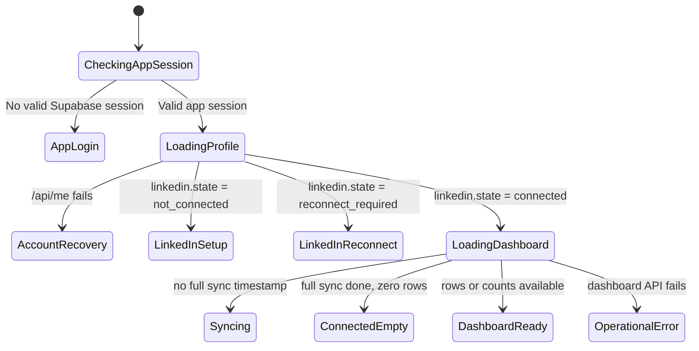

# feat: Add LinkedIn onboarding flow

## Overview

Add a dedicated signed-in onboarding experience for users who still need to connect or reconnect LinkedIn before the dashboard is useful. The change keeps Gladly app authentication as the first gate, then routes app-authenticated users through clear LinkedIn readiness states before showing dashboard metrics.

## Problem Frame

The current dashboard can show a generic "Unable to load dashboard" error or a table empty state for cases that are really setup states. Per the origin requirements, users should not see raw provider/network messages, demo data, or dashboard content when the app still needs LinkedIn authorization or initial sync context (see origin: `docs/brainstorms/2026-04-30-linkedin-onboarding-requirements.md`).

## Requirements Trace

- R1. Users without a valid Gladly app session are redirected to login with a safe return path.
- R2. Signed-in users without a connected LinkedIn account see a dedicated onboarding screen instead of dashboard metrics.
- R3. Signed-in users whose LinkedIn account requires reconnection see reconnect-specific onboarding.
- R4. The setup experience is first-class and not buried inside the dashboard table.
- R5. Onboarding copy explains the next action plainly.
- R6. The primary onboarding action starts the existing Unipile Hosted Auth flow.
- R7. The header keeps signed-in Gladly identity when it can be loaded.
- R8. App profile load failures show recovery guidance instead of low-level provider text.
- R9. Dashboard metrics render only when LinkedIn is connected and dashboard data can load.
- R10. Connected users with no synced relationships see a syncing or empty-data state distinct from not-connected.
- R11. Demo rows and counts remain absent from authenticated production states.
- R12. Auth/session failures route to login instead of raw Supabase or network errors.
- R13. Backend/sync failures after valid auth and LinkedIn connection show retryable operational errors.
- R14. User-facing error text is action-oriented and does not lead with raw infrastructure messages.

## Scope Boundaries

- Do not add LinkedIn send, invite, or automation actions.
- Do not redesign the whole dashboard beyond readiness/onboarding states.
- Do not add demo data as fallback content.
- Do not replace the current Supabase app-auth flow unless implementation reveals it is misconfigured.

## Context & Research

### Relevant Code and Patterns

- `src/components/auth/require-auth.tsx` already gates app-authenticated pages and redirects unauthenticated users.
- `src/components/dashboard/authenticated-dashboard.tsx` already fetches the Supabase session, `/api/me`, and `/api/dashboard`, then renders loading, error, empty, and ready states.
- `app/api/me/route.ts` returns the app user plus LinkedIn account status through `buildCurrentUserStatus`.
- `src/server/auth/current-user-status.ts` already classifies LinkedIn as `not_connected`, `connected`, or `reconnect_required` and includes sync timestamps.
- `src/server/dashboard/current-user-dashboard.ts` returns real per-user relationship counts and rows.
- `src/components/linkedin/linkedin-connect-button.tsx` already starts the Hosted Auth flow for a signed-in user.
- `app/api/linkedin/connect-url/route.ts` already supports `reconnectAccountId` in the request body.
- `src/server/jobs/runtime-sync-store.ts` marks `lastFullSyncAt` after a full sync, which can distinguish "sync not complete yet" from "synced but empty" when combined with dashboard row counts.

### Institutional Learnings

- No `docs/solutions/` directory was present during planning.
- Prior plans in `docs/plans/2026-04-30-001-fix-linkedin-hosted-auth-redirect-plan.md` and `docs/plans/2026-04-30-002-fix-auth-user-linkedin-persistence-plan.md` establish the current approach: app-authenticated users are persisted as `app_users`, and Unipile `account_id` is stored against the current app user.

### External References

- Unipile Hosted Auth docs: use a backend-created Hosted Auth URL, short expiration, `notify_url`, and `name` to map the connected account back to the internal user.
  - https://developer.unipile.com/docs/hosted-auth
- Unipile connection methods docs: recommended integration stores connected accounts, handles success/failure landing pages, supports reconnect, and processes account status webhooks.
  - https://developer.unipile.com/docs/connect-accounts
- Unipile account lifecycle docs: `CREDENTIALS` requires user reconnection; `CREATION_SUCCESS`, `RECONNECTED`, and `SYNC_SUCCESS` are lifecycle states relevant to onboarding readiness.
  - https://developer.unipile.com/docs/account-lifecycle

## Key Technical Decisions

- Use `/api/me` as the first readiness source: It already identifies the current app user and LinkedIn account state, so the dashboard can avoid calling `/api/dashboard` when LinkedIn setup is required.
- Classify readiness in a shared typed helper: Keep branching consistent between component tests and runtime UI without forcing a new endpoint before it is needed.
- Reuse the existing Hosted Auth button path: The onboarding CTA should call the existing `/api/linkedin/connect-url` route rather than introducing a second LinkedIn connection mechanism.
- Keep Unipile account ids server-owned for reconnect: The client should send the local LinkedIn account id from `/api/me`; the backend should verify ownership and map it to the stored Unipile `account_id` before creating a reconnect Hosted Auth link.
- Treat raw infrastructure errors as diagnostic details, not primary UX: User-facing screens should say what to do next; implementation can preserve raw messages only in secondary detail when useful.
- Use sync timestamps plus dashboard rows for R10: If a connected account has no `lastFullSyncAt`, show syncing/setup-progress. If a connected account has `lastFullSyncAt` but zero rows, show connected-empty.

## Open Questions

### Resolved During Planning

- Can existing sync timestamps distinguish syncing from connected-empty? Yes for the immediate UX: `lastFullSyncAt` is set by the full sync path, so connected accounts with no full-sync timestamp can render a syncing state. If later operations require richer sync status, that should be a separate enhancement.
- What should happen when app profile load fails? Show an account/session recovery state with "Sign in again" and "Retry" actions, while avoiding raw provider/DNS text as the primary message.

### Deferred to Implementation

- Exact copy for each onboarding state: The plan defines intent; final wording can be adjusted during implementation to fit available component space.
- Whether to expose a new field from `/api/me` or keep readiness purely client-side: Prefer a shared helper first; add a response field only if implementation shows this reduces duplication without breaking existing tests.

## High-Level Technical Design

> *This illustrates the intended approach and is directional guidance for review, not implementation specification. The implementing agent should treat it as context, not code to reproduce.*

## Implementation Units

- [x] **Unit 1: Centralize dashboard readiness classification**

**Goal:** Define a small shared model that converts current user status and dashboard data into explicit UI states: app recovery, LinkedIn setup, LinkedIn reconnect, syncing, connected-empty, dashboard-ready, and operational-error.

**Requirements:** R2, R3, R8, R9, R10, R13, R14

**Dependencies:** Existing `/api/me` response shape and dashboard response shape.

**Files:**
- Create: `src/components/dashboard/dashboard-readiness.ts`
- Modify: `src/components/dashboard/authenticated-dashboard.tsx`
- Test: `tests/components/dashboard-readiness.test.ts`

**Approach:**
- Keep the helper framework-light and testable.
- Use `linkedin.state` as the setup/reconnect gate.
- Use account `lastFullSyncAt` and dashboard row/summary state to distinguish syncing from connected-empty.
- Represent app profile failures as a separate recovery state rather than a generic dashboard error.

**Patterns to follow:**
- Type style from `src/components/dashboard/authenticated-dashboard.tsx`.
- Current user status shape from `src/components/auth/authenticated-user-summary.tsx` and `src/server/auth/current-user-status.ts`.

**Test scenarios:**
- Happy path: `linkedin.state = not_connected` with no dashboard payload -> readiness is LinkedIn setup.
- Happy path: `linkedin.state = reconnect_required` with an account id -> readiness is LinkedIn reconnect.
- Happy path: connected account with `lastFullSyncAt = null` -> readiness is syncing.
- Happy path: connected account with `lastFullSyncAt` and zero rows -> readiness is connected-empty.
- Happy path: connected account with dashboard rows -> readiness is dashboard-ready.
- Error path: profile API failure -> readiness is account recovery, not operational dashboard error.
- Error path: dashboard API failure after connected profile -> readiness is operational-error.

**Verification:**
- Readiness states are deterministic in unit tests and do not require a browser or Supabase client.

- [x] **Unit 2: Render dedicated onboarding and recovery screens in the dashboard**

**Goal:** Replace generic dashboard error/empty rendering for setup states with dedicated signed-in onboarding screens.

**Requirements:** R2, R3, R4, R5, R6, R7, R8, R9, R10, R11, R13, R14

**Dependencies:** Unit 1 readiness helper.

**Files:**
- Modify: `src/components/dashboard/authenticated-dashboard.tsx`
- Test: `tests/components/authenticated-dashboard.test.tsx`

**Approach:**
- Keep the existing dashboard shell/header so the experience still feels inside the app.
- Fetch `/api/me` first; only fetch `/api/dashboard` after the user has a connected LinkedIn account.
- Add dedicated body views for setup, reconnect, syncing, connected-empty, account recovery, and operational error.
- Primary setup/reconnect actions should use the same Hosted Auth flow as settings.
- The operational error view can keep a retry button, but primary copy should be friendly and not lead with raw infrastructure details.

**Patterns to follow:**
- Existing shell/layout in `src/components/dashboard/authenticated-dashboard.tsx`.
- Existing button/card styling from Gladly components in `src/components/gladly/`.
- Existing auth redirect behavior in `src/components/auth/require-auth.tsx`.

**Test scenarios:**
- Happy path: signed-in `/api/me` response with `not_connected` renders a dedicated onboarding heading and "Connect LinkedIn"; dashboard bucket cards are absent.
- Happy path: signed-in `/api/me` response with `reconnect_required` renders "Reconnect LinkedIn" and passes the account id to the connect action.
- Happy path: connected account with no full sync timestamp renders a syncing/progress state instead of "No LinkedIn relationship data yet."
- Happy path: connected account with completed sync and zero rows renders connected-empty state.
- Happy path: connected account with rows renders existing dashboard metrics and table.
- Error path: `/api/me` non-401 failure renders account recovery with "Sign in again" and "Retry"; raw provider/DNS text is not the primary heading.
- Error path: `/api/dashboard` failure after connected `/api/me` renders retryable operational error.
- Regression: demo names and counts do not render in any setup, syncing, empty, or error state.

**Verification:**
- Component tests prove each visible state.
- Manual browser smoke can verify that a signed-in user without LinkedIn sees onboarding rather than an error box.

- [x] **Unit 3: Make LinkedIn connect CTA reusable for setup and reconnect**

**Goal:** Let onboarding screens start either connect or reconnect Hosted Auth without duplicating fetch/session logic or exposing Unipile account ids to the client.

**Requirements:** R3, R5, R6, R12, R14

**Dependencies:** Existing connect URL API and Unit 2 onboarding screens.

**Files:**
- Modify: `src/components/linkedin/linkedin-connect-button.tsx`
- Modify: `app/api/linkedin/connect-url/route.ts`
- Modify: `src/server/db/repositories/linkedin-accounts.ts`
- Test: `tests/components/linkedin-connect-button.test.tsx`
- Test: `tests/api/linkedin-connect-url.test.ts`

**Approach:**
- Extend the existing button with props for mode, label, return path, and reconnect account id.
- Keep app-auth failures routing to login.
- Keep route-side ownership protection through the existing app-user auth helper.
- For reconnect, have the request body include the app's local LinkedIn account id from `/api/me`.
- In the API route, verify that local account belongs to the current app user, then pass its stored Unipile account id to the Hosted Auth `reconnect_account` field.
- Show user-facing failures such as "Unable to start LinkedIn connection. Try again." rather than raw provider errors in the button surface.

**Patterns to follow:**
- Current `LinkedInConnectButton` session and fetch behavior.
- `buildHostedAuthLinkInput` reconnect support in `src/server/unipile/connection.ts`.
- Ownership lookup patterns from `src/server/linkedin/sync-actions.ts` and `src/server/db/repositories/linkedin-accounts.ts`.
- Existing route tests in `tests/api/linkedin-connect-url.test.ts`.

**Test scenarios:**
- Happy path: signed-in connect click posts to `/api/linkedin/connect-url` with no reconnect account id and navigates to returned URL.
- Happy path: signed-in reconnect click posts with the local LinkedIn account id and navigates to returned URL.
- Error path: missing app session redirects to `/login` with a safe `next`.
- Error path: reconnect request for another user's LinkedIn account is rejected before Hosted Auth link creation.
- Error path: connect URL API failure renders friendly status text without raw provider payload as the primary message.
- Integration: API payload for reconnect maps the owned local account to Unipile Hosted Auth `type = reconnect` and `reconnect_account`.

**Verification:**
- Button tests cover setup and reconnect usage.
- Existing connect URL tests continue to prove Hosted Auth payload shape.

- [x] **Unit 4: Normalize profile/status error presentation**

**Goal:** Make profile and session failures recoverable and consistent across the dashboard header, dashboard body, and LinkedIn settings.

**Requirements:** R1, R7, R8, R12, R14

**Dependencies:** Unit 1 readiness concepts; existing auth summary component.

**Files:**
- Modify: `src/components/auth/authenticated-user-summary.tsx`
- Modify: `src/components/auth/require-auth.tsx`
- Modify: `src/components/dashboard/authenticated-dashboard.tsx`
- Test: `tests/components/authenticated-user-summary.test.tsx`
- Test: `tests/components/authenticated-dashboard.test.tsx`

**Approach:**
- Keep session lookup failures as unauthenticated and redirect to login.
- Keep profile API failures visible, but make the header secondary to the main recovery screen.
- Provide a clear sign-in-again path for profile failures because the most useful user action is to refresh/re-establish app auth.
- Avoid putting raw infrastructure text in primary headings or prominent red body copy.

**Patterns to follow:**
- `loginRedirectFor` safe redirect handling in `src/components/auth/require-auth.tsx`.
- Existing `AuthenticatedUserSummaryView` variants.

**Test scenarios:**
- Happy path: ready profile renders real name and initials in the menu.
- Error path: summary menu renders a compact profile issue state, not indefinite loading.
- Error path: dashboard account recovery body offers retry and sign-in actions.
- Error path: thrown Supabase session read routes to login rather than rendering an error box.
- Regression: `/settings/linkedin` still shows connected, reconnect, and not-connected states from `/api/me`.

**Verification:**
- Tests distinguish app-auth failures from profile-load failures.
- The screenshot failure mode no longer appears as primary dashboard content.

- [x] **Unit 5: Cover backend readiness and lifecycle assumptions**

**Goal:** Ensure server-side status and sync fields provide enough signal for the onboarding UI and remain aligned with Unipile lifecycle behavior.

**Requirements:** R2, R3, R9, R10, R13

**Dependencies:** Existing Unipile hosted-auth persistence and account status webhook handling.

**Files:**
- Modify: `src/server/auth/current-user-status.ts`
- Modify: `src/server/db/repositories/linkedin-accounts.ts`
- Modify: `src/server/webhooks/unipile-events.ts`
- Modify: `src/server/webhooks/runtime-processing.ts`
- Test: `tests/api/current-user-status.test.ts`
- Test: `tests/jobs/process-unipile-account-status-webhook.test.ts`
- Test: `tests/api/unipile-webhooks.test.ts`

**Approach:**
- Preserve the existing `not_connected`, `connected`, and `reconnect_required` states.
- If implementation needs a richer field for UI readiness, add it compatibly rather than replacing the existing state.
- Confirm account status webhook processing keeps `CREDENTIALS` and other non-OK statuses mapped to reconnect-required.
- Confirm `lastFullSyncAt` remains available to the client for syncing vs connected-empty classification.

**Patterns to follow:**
- `buildCurrentUserStatus` test style in `tests/api/current-user-status.test.ts`.
- Webhook parsing tests in `tests/jobs/process-unipile-account-status-webhook.test.ts`.
- Unipile account lifecycle docs for `CREDENTIALS`, `CREATION_SUCCESS`, `RECONNECTED`, and `SYNC_SUCCESS`.

**Test scenarios:**
- Happy path: no LinkedIn accounts -> `linkedin.state = not_connected`.
- Happy path: healthy account with no full sync timestamp still returns connected account metadata needed for syncing UI.
- Happy path: healthy account with full sync timestamp returns metadata needed for connected-empty/ready UI.
- Error/lifecycle path: `CREDENTIALS` webhook marks account reconnect-required.
- Edge case: if any account requires reconnect, user status prioritizes reconnect-required over connected.

**Verification:**
- Server tests confirm the UI receives stable state signals without relying on demo data or client guesses.

## System-Wide Impact

- **Interaction graph:** App route `/` goes through `RequireAuth`, then `/api/me`, then conditional LinkedIn onboarding or `/api/dashboard`. LinkedIn setup and reconnect actions go through `/api/linkedin/connect-url`, Unipile Hosted Auth, `/linkedin/connected`, and `/api/linkedin/claim-connected-account` or notify callback.
- **Error propagation:** Session failures redirect to login. Profile-load failures render account recovery. Dashboard-data failures render operational retry. LinkedIn not-connected/reconnect states render onboarding, not errors.
- **State lifecycle risks:** Newly connected accounts may be persisted before full sync completes. The UI must not treat "connected but no rows" as the same state as "not connected."
- **API surface parity:** `/settings/linkedin` and `/` should both use the same current user/LinkedIn state source.
- **Integration coverage:** Tests should cover the multi-step path from current user status to onboarding CTA payload; API tests should continue covering Hosted Auth reconnect payloads.
- **Unchanged invariants:** Protected routes still require Supabase app auth. Unipile API keys remain server-only. The dashboard still queries only the current app user's relationships.

## Risks & Dependencies

| Risk | Mitigation |
|------|------------|
| A connected account has zero rows because sync has not run yet, causing confusing empty copy. | Use `lastFullSyncAt` to show syncing until the first full sync completes. |
| Reconnect CTA targets the wrong account. | Use the account id from `/api/me` and preserve route-side app-user auth; keep API tests for reconnect payload shape. |
| Raw backend messages leak into primary UI again. | Add component tests that assert friendly headings and absence of raw demo/error text in primary states. |
| Current Inngest/job wiring may not expose enough sync progress detail. | Defer richer progress tracking; the immediate UX only needs first full-sync timestamp vs none. |
| Account status webhooks are accepted but not processed promptly. | Keep UI based on persisted account state and retain manual reconnect access in settings; planning notes this as an operational dependency. |

## Documentation / Operational Notes

- Update `docs/ops/linkedin-auth-user-cleanup.md` only if implementation changes operator recovery steps.
- After implementation, smoke test production with three states if possible: signed out, signed in without LinkedIn, and signed in with connected LinkedIn.
- Confirm Vercel environment variables point to the correct Supabase project; UX should hide raw DNS messages, but misconfigured auth still needs operational correction.

## Sources & References

- **Origin document:** [docs/brainstorms/2026-04-30-linkedin-onboarding-requirements.md](../brainstorms/2026-04-30-linkedin-onboarding-requirements.md)
- Related code: `src/components/dashboard/authenticated-dashboard.tsx`
- Related code: `src/components/linkedin/linkedin-connect-button.tsx`
- Related code: `src/server/auth/current-user-status.ts`
- Related code: `app/api/me/route.ts`
- Related code: `app/api/dashboard/route.ts`
- Related code: `app/api/linkedin/connect-url/route.ts`
- External docs: https://developer.unipile.com/docs/hosted-auth
- External docs: https://developer.unipile.com/docs/connect-accounts
- External docs: https://developer.unipile.com/docs/account-lifecycle
