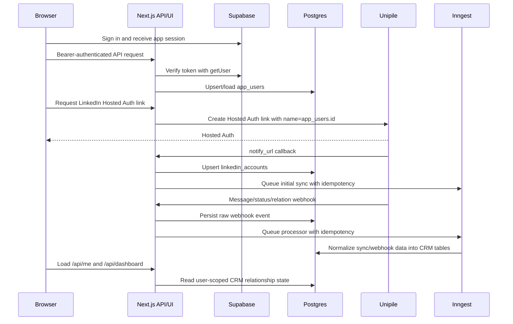
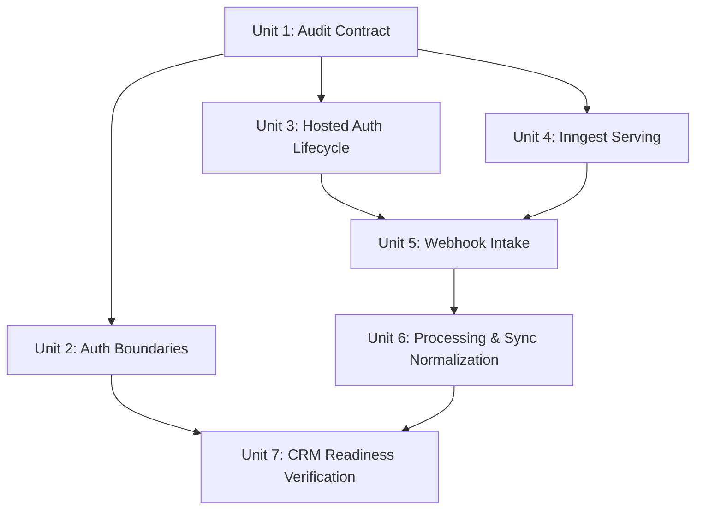
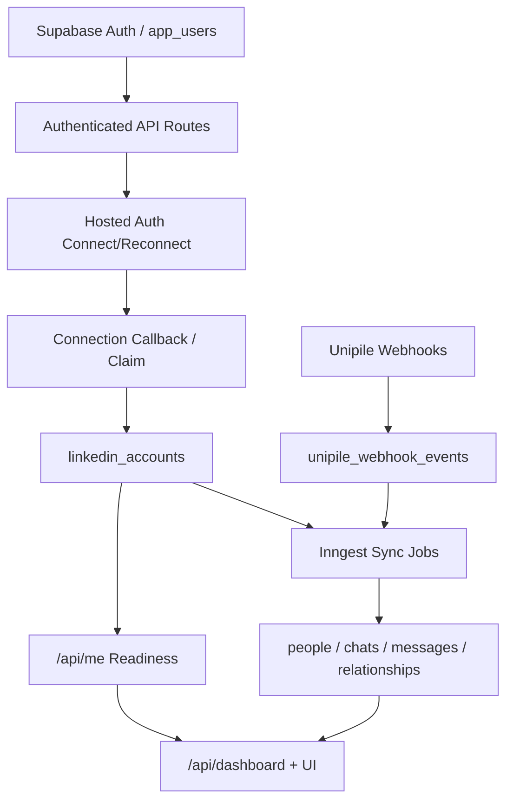

# fix: Audit and repair CRM integration wiring

## Overview

Run a full integration audit and repair pass for the authenticated LinkedIn CRM path outside the onboarding work. The target system is: a user signs in with Gladly app auth, connects or reconnects LinkedIn through Unipile Hosted Auth, Unipile callbacks and webhooks are accepted and processed, Inngest workers execute sync and webhook jobs, normalized LinkedIn activity persists to Postgres, and the dashboard reads only the signed-in user's real CRM relationship data.

| Mode | Entry Point | Expected Terminal State |
|------|-------------|-------------------------|
| App auth | `/login`, Supabase browser session, bearer-auth API routes | Durable `app_users` row and user-scoped API access |
| LinkedIn connect/reconnect | `/api/linkedin/connect-url`, Unipile Hosted Auth, `/linkedin/connected` | Owned `linkedin_accounts` row and queued initial sync |
| Webhooks | `/api/linkedin/connection-callback`, `/api/webhooks/unipile/*` | Raw event persisted, job queued, account/message/relation state updated |
| Sync jobs | Inngest events from callbacks, manual resync, and webhooks | Chats, messages, people, relationships, account sync timestamps persisted |
| CRM dashboard | `/api/me`, `/api/dashboard`, dashboard UI | Connected user's relationship rows, counts, readiness, and errors are accurate |

## Problem Frame

The repo has pieces of the CRM pipeline, but a static audit shows the end-to-end wiring is not yet proven as a working production system. Auth and LinkedIn persistence were addressed by recent plans, and onboarding readiness has its own active plan, but this work needs to audit the whole CRM integration path: auth boundaries, Hosted Auth callbacks, Unipile webhook registration/shape, Inngest serving, job idempotency, sync persistence, dashboard queries, and operational verification.

Known local risk signals discovered during planning:

- Inngest functions exist under `inngest/functions/`, but no `app/api/inngest/route.ts` serve endpoint is present.
- Unipile account-status docs show a nested `AccountStatus` payload with status in `message`, while current parsing expects top-level `account_id` and `status`.
- Webhook intake persists raw events but has no durable uniqueness constraint or Inngest event idempotency key tied to Unipile event IDs.
- Sync code has an `accountUserProviderId` concept, but the persisted LinkedIn account record does not store it, which can make initial-sync message direction unreliable.
- Runtime webhook processing inserts new-relation people directly and can duplicate people when provider identifiers repeat.
- Live deployment wiring still needs verification: app origin, Supabase redirect allowlist, Unipile dashboard webhooks, webhook auth header, Inngest signing/event keys, and worker endpoint registration.
- Unipile webhook routes exist in code, but code alone does not prove the Unipile dashboard/API has registered those callback URLs for messaging, account-status, and new-relation events.

## Requirements Trace

- R1. Audit every externally reachable auth, Hosted Auth, webhook, sync, and dashboard entry point for reachable production wiring.
- R2. Preserve app auth and LinkedIn auth as separate trust boundaries: Supabase identifies the app user; Unipile identifies connected external accounts.
- R3. Ensure every user-owned route resolves a durable `app_users.id` and enforces ownership before reads, writes, imports, syncs, or reconnects.
- R4. Ensure Hosted Auth create and reconnect flows use backend-generated links, short expirations, absolute callback URLs, internal user mapping, and signed browser claim repair.
- R5. Ensure Unipile callback and webhook handlers authenticate incoming requests consistently with the configured `Unipile-Auth` secret.
- R6. Accept documented Unipile payload shapes for Hosted Auth callbacks, account status, new messages, and new relations.
- R7. Persist raw webhook events quickly, enqueue background work, and keep webhook route responses within Unipile retry expectations.
- R8. Serve Inngest functions in Next.js and make queued jobs idempotent enough to survive duplicate callbacks, webhook retries, and manual resyncs.
- R9. Normalize account metadata, provider user IDs, chats, messages, people, and relationships so message direction and CRM state are deterministic.
- R10. Keep dashboard and `/api/me` readiness tied to real account/sync state, not demo data or optimistic UI assumptions.
- R11. Add focused regression coverage for auth boundaries, callback/webhook payload variants, job serving/queue mapping, idempotency, sync normalization, and dashboard output.
- R12. Produce an operational audit runbook that distinguishes code fixes from live configuration checks.
- R13. Verify or reconcile Unipile webhook registrations so all required webhook sources point at the deployed app with the expected auth header.

## Scope Boundaries

- This plan does not change the separate LinkedIn onboarding product flow plan; it may rely on its readiness UI but should not expand that plan.
- Do not add LinkedIn send, invite, sequence, or automation actions.
- Do not replace Supabase auth with a new provider.
- Do not implement a broad CRM matching redesign beyond what is needed to prove synced LinkedIn activity reaches current dashboard rows.
- Do not perform live production cleanup without the explicit audit/runbook safeguards in `docs/ops/linkedin-auth-user-cleanup.md`.

### Deferred to Separate Tasks

- Rich Salesforce/CRM account matching and writeback: separate CRM enrichment plan after the LinkedIn sync path is reliable.
- Legal/security review for any future outbound LinkedIn action: separate v2 approval process.
- Cookie-based SSR auth migration: separate hardening task if server-rendered personalization becomes necessary.

## Context & Research

### Relevant Code and Patterns

- `src/server/auth/request-session.ts` verifies bearer tokens with Supabase `getUser`.
- `src/server/auth/request-app-user.ts` resolves the verified auth identity into an `app_users` row.
- `app/api/me/route.ts`, `app/api/dashboard/route.ts`, `app/api/linkedin/connect-url/route.ts`, `app/api/import/artifact/route.ts`, and manual sync routes already use bearer-authenticated app-user resolution.
- `src/server/unipile/connection.ts` builds Hosted Auth URLs, signed claim tokens, and parses Hosted Auth callback payloads.
- `app/api/linkedin/connection-callback/route.ts` and `src/server/linkedin/claim-connected-account.ts` provide two paths to persist a connected Unipile account.
- `app/api/webhooks/unipile/messaging/route.ts`, `app/api/webhooks/unipile/account-status/route.ts`, and `app/api/webhooks/unipile/users/route.ts` accept webhook payloads and enqueue Inngest events.
- `src/server/webhooks/unipile-events.ts` and `src/server/webhooks/runtime-processing.ts` normalize and process webhook data.
- `inngest/functions/*.ts` defines sync and webhook functions, but there is no discovered `serve()` route exposing them to Inngest.
- `src/server/jobs/linkedin-sync.ts` imports historical chats/messages and recomputes relationship state.
- `src/server/dashboard/current-user-dashboard.ts` builds dashboard rows from persisted relationships joined to people and CRM accounts.
- `docs/plans/2026-04-29-001-feat-linkedin-relationship-tracker-plan.md` defines the original CRM architecture and v1 non-send posture.
- `docs/plans/2026-04-30-001-fix-linkedin-hosted-auth-redirect-plan.md` and `docs/plans/2026-04-30-002-fix-auth-user-linkedin-persistence-plan.md` record recent Hosted Auth origin and user-persistence decisions.
- `docs/ops/linkedin-auth-user-cleanup.md` provides production cleanup safety rules for demo-owned auth data.

### Institutional Learnings

- No `docs/solutions/` directory exists in this repo.
- Existing plans establish two important local decisions: use `app_users.id` as the internal Unipile user key, and keep the Unipile `account_id` server-owned except for signed Hosted Auth claim repair.

### External References

- Unipile Hosted Auth docs: backend-generated Hosted Auth links, `notify_url`, `name` internal ID echo, short expiration, and reconnect with `reconnect_account`: https://developer.unipile.com/docs/hosted-auth
- Unipile webhooks docs: webhook routes should return `200` in under 30 seconds; webhook auth can use an `Unipile-Auth` header: https://developer.unipile.com/docs/webhooks-2
- Unipile new-message webhook docs: sent messages arrive in the same message webhook, direction can be inferred by comparing `account_info.user_id` with `sender.attendee_provider_id`, and old messages are not sent on initial connection: https://developer.unipile.com/docs/new-messages-webhook
- Unipile account lifecycle docs: `CREDENTIALS` requires reconnect, `CREATION_SUCCESS`/`RECONNECTED` can arrive through webhook and Hosted Auth notify with different formats, and `SYNC_SUCCESS` marks synchronization completion: https://developer.unipile.com/docs/account-lifecycle
- Unipile changelog shows active LinkedIn and webhook feature updates; no deprecation/sunset signal was found during planning: https://developer.unipile.com/changelog
- Inngest Next.js docs require a served API route exporting `GET`, `POST`, and `PUT` for App Router function discovery/execution: https://www.inngest.com/docs/learn/serving-inngest-functions
- Inngest idempotency docs recommend event IDs or function-level idempotency keys for duplicate-safe processing: https://www.inngest.com/docs/guides/handling-idempotency
- Supabase `auth.getUser(jwt)` docs state it performs an Auth server request and can be used for authorization decisions: https://supabase.com/docs/reference/javascript/auth-getuser
- Next.js 15 route handler docs define App Router `route.ts` handlers using standard Web Request/Response APIs: https://nextjs.org/docs/15/app/api-reference/file-conventions/route

## Key Technical Decisions

- Make the audit executable where possible: add focused regression tests and a runbook instead of relying only on manual inspection.
- Add the Inngest serve route before relying on any queued sync/webhook behavior: queued events do not make the CRM work unless workers are discoverable and executable.
- Treat Unipile webhook registration as an audited integration surface: receiving routes are necessary but insufficient unless the external Unipile account is configured to call them.
- Treat webhook routes as durable event intake only: validate/authenticate, persist raw payload, enqueue an idempotent job, and return quickly.
- Normalize Unipile payloads at boundary modules: route handlers should not know every payload variant; parsers should handle documented envelopes and top-level variants.
- Persist the connected account's provider user identity when available: initial sync and webhook processors need it to determine inbound versus outbound messages consistently.
- Use database uniqueness plus Inngest idempotency: Unipile retries and user double-clicks should not duplicate accounts, messages, people, jobs, or relationship events.
- Keep operational config checks in `docs/ops/`: live Unipile dashboard webhooks, Vercel env values, Supabase redirect allowlist, and Inngest registration are not fully knowable from code alone.

## Open Questions

### Resolved During Planning

- Should this update the onboarding plan? No. The user requested a full audit outside onboarding.
- Is external research needed? Yes. Auth, Unipile, webhooks, and Inngest are high-risk external integration surfaces.
- Is Unipile Hosted Auth deprecated? No deprecation or sunset signal was found in current official docs/changelog during planning.
- Can the repo already process queued jobs in production? Not proven. Inngest functions exist, but the required App Router serve endpoint was not found.

### Deferred to Implementation

- Exact live Unipile webhook registrations: must be verified against the Unipile dashboard/API during the audit.
- Exact deployed environment values: must be checked in the deployment platform without copying secrets into docs.
- Real webhook payload samples: should be captured from safe staging/live events or official fixtures during implementation.
- Exact Unipile webhook source names and dashboard/API registration payloads: implementation should confirm against the current API reference before creating or reconciling live webhooks.
- Whether account-status should drive `lastFullSyncAt` from `SYNC_SUCCESS`: implementation should confirm payload shape and current product readiness semantics before changing that field.

## High-Level Technical Design

> *This illustrates the intended approach and is directional guidance for review, not implementation specification. The implementing agent should treat it as context, not code to reproduce.*

## Implementation Units

- [x] **Unit 1: Establish the CRM wiring audit contract**

**Goal:** Create a concrete audit map that defines every required entry point, event name, environment variable, external callback URL, database side effect, and verification scenario for the CRM pipeline.

**Requirements:** R1, R11, R12, R13

**Dependencies:** None

**Files:**
- Create: `docs/ops/crm-integration-audit.md`
- Modify: `README.md`
- Test expectation: none -- this unit creates the audit/runbook contract; executable registry coverage belongs with the Inngest serving unit.

**Approach:**
- Document the expected code and live-config wiring from app auth through dashboard readiness.
- Include an audit checklist for local code, deployment env, Supabase auth redirect URLs, Unipile dashboard/API webhooks, Inngest registration, and database state.
- Keep secrets out of the runbook; document variable names, expected presence, callback origins, and safe verification steps only.

**Patterns to follow:**
- Safety style from `docs/ops/linkedin-auth-user-cleanup.md`.
- Environment variable list from `README.md` and `src/server/config/env.ts`.

**Test scenarios:**
- Test expectation: none -- documentation/runbook unit with no runtime behavior.

**Verification:**
- An implementer can run the audit from the runbook and know whether a failure is code, deployment config, Unipile config, Inngest config, or data state.

- [x] **Unit 2: Harden app auth and ownership boundaries**

**Goal:** Prove and repair user identity resolution and ownership enforcement across every authenticated route that can read, write, import, or queue CRM data.

**Requirements:** R2, R3, R10, R11

**Dependencies:** Unit 1

**Files:**
- Modify: `src/server/auth/request-session.ts`
- Modify: `src/server/auth/request-app-user.ts`
- Modify: `src/server/auth/ownership.ts`
- Modify: `app/api/me/route.ts`
- Modify: `app/api/dashboard/route.ts`
- Modify: `app/api/import/artifact/route.ts`
- Modify: `app/api/linkedin/accounts/[id]/sync/route.ts`
- Modify: `app/api/linkedin/accounts/[id]/resync-full/route.ts`
- Modify: `src/server/import/artifact-persistence.ts`
- Test: `tests/api/authenticated-route-access.test.ts`
- Test: `tests/api/current-user-status.test.ts`
- Test: `tests/api/dashboard.test.ts`
- Test: `tests/integration/artifact-import.test.ts`

**Approach:**
- Confirm every bearer-auth route uses `requireRequestAppUser` before user-owned data access.
- Make ownership checks explicit for artifact import and sync account IDs, not only dashboard and reconnect flows.
- Keep `authUserId` and `app_users.id` naming distinct in helpers and tests.
- Treat missing/expired app auth as `401`, wrong-owner resources as `403`, and operational failures as non-auth errors.

**Execution note:** Add characterization coverage for each current route before changing route behavior.

**Patterns to follow:**
- `app/api/linkedin/connect-url/route.ts` app-user resolution.
- `src/server/auth/ownership.ts` ownership assertion.
- `docs/plans/2026-04-30-002-fix-auth-user-linkedin-persistence-plan.md` identity distinction.

**Test scenarios:**
- Happy path: signed-in user receives `/api/me` and `/api/dashboard` for their own `app_users.id`.
- Happy path: signed-in user can queue sync only for a LinkedIn account they own.
- Happy path: artifact import persists rows only under the signed-in user's owned LinkedIn account.
- Error path: missing bearer token returns `401` and does not touch the database.
- Error path: valid user A token cannot import or sync user B's LinkedIn account.
- Regression: route tests never use demo identity as the production authenticated user.

**Verification:**
- All user-owned CRM reads/writes require app-user resolution and pass ownership tests.

- [x] **Unit 3: Repair Hosted Auth lifecycle and account persistence**

**Goal:** Make create, reconnect, callback, and browser-claim paths converge on one owned LinkedIn account lifecycle without duplicate sync jobs or unsafe account claiming.

**Requirements:** R2, R3, R4, R5, R8, R11

**Dependencies:** Unit 1, Unit 2

**Files:**
- Modify: `app/api/linkedin/connect-url/route.ts`
- Modify: `app/api/linkedin/connection-callback/route.ts`
- Modify: `app/api/linkedin/claim-connected-account/route.ts`
- Modify: `src/server/unipile/connection.ts`
- Modify: `src/server/linkedin/connect-url.ts`
- Modify: `src/server/linkedin/connection-callback.ts`
- Modify: `src/server/linkedin/claim-connected-account.ts`
- Modify: `src/server/db/repositories/linkedin-accounts.ts`
- Test: `tests/api/linkedin-connect-url.test.ts`
- Test: `tests/api/linkedin-callback.test.ts`
- Test: `tests/server/unipile/client.test.ts`

**Approach:**
- Keep Hosted Auth link creation server-side and verify the outgoing Unipile request body includes absolute success, failure, and notify URLs.
- Require webhook-secret authentication consistently for Hosted Auth notify callbacks in deployed environments; avoid accepting unauthenticated callbacks just because the secret is missing.
- Ensure `name` maps to `app_users.id`, and reconnect uses the locally owned account ID to resolve the server-owned Unipile account ID.
- Make callback and signed browser claim paths idempotent: the same Unipile account should upsert one local account and queue at most the intended sync work.
- Preserve the browser claim path as a repair/confirmation path, not as a substitute for webhook validation.

**Patterns to follow:**
- `buildHostedAuthLinkInput` callback URL construction.
- `createHostedAuthClaimToken` and `verifyHostedAuthClaimToken`.
- Prior redirect-origin plan in `docs/plans/2026-04-30-001-fix-linkedin-hosted-auth-redirect-plan.md`.

**Test scenarios:**
- Happy path: Hosted Auth create payload uses `type=create`, `providers=["LINKEDIN"]`, `name=app_users.id`, and valid absolute callback URLs.
- Happy path: reconnect payload uses `type=reconnect` and maps local account ID to owned Unipile `reconnect_account`.
- Happy path: `CREATION_SUCCESS` callback with valid secret upserts one account and queues initial sync.
- Happy path: `RECONNECTED` callback clears reconnect state and queues the correct sync behavior.
- Error path: missing or wrong callback secret is rejected before account mutation.
- Error path: claim token for user A cannot be used by user B.
- Regression: duplicate callback or claim for the same `account_id` does not create duplicate accounts or duplicate unbounded sync jobs.

**Verification:**
- Hosted Auth connection state survives refresh/re-login and has exactly one owner in `linkedin_accounts`.

- [x] **Unit 4: Serve Inngest functions and make job dispatch idempotent**

**Goal:** Ensure background jobs are reachable in deployed Next.js and queued with duplicate-safe event identity.

**Requirements:** R7, R8, R11, R12

**Dependencies:** Unit 1

**Files:**
- Create: `app/api/inngest/route.ts`
- Create: `inngest/functions/index.ts`
- Create: `tests/integration/crm-wiring-contract.test.ts`
- Modify: `src/server/jobs/client.ts`
- Modify: `src/server/linkedin/runtime.ts`
- Modify: `src/server/webhooks/runtime.ts`
- Modify: `src/server/linkedin/connection-callback.ts`
- Modify: `src/server/linkedin/claim-connected-account.ts`
- Modify: `src/server/linkedin/sync-actions.ts`
- Modify: `inngest/functions/sync-linkedin-account-initial.ts`
- Modify: `inngest/functions/sync-linkedin-account-partial.ts`
- Modify: `inngest/functions/process-unipile-message-webhook.ts`
- Modify: `inngest/functions/process-unipile-account-status-webhook.ts`
- Modify: `inngest/functions/process-unipile-user-webhook.ts`
- Test: `tests/jobs/inngest-serving.test.ts`
- Test: `tests/api/linkedin-sync-actions.test.ts`
- Test: `tests/api/linkedin-callback.test.ts`
- Test: `tests/api/unipile-webhooks.test.ts`

**Approach:**
- Add the App Router Inngest serve endpoint exporting `GET`, `POST`, and `PUT`.
- Centralize function exports in one registry so the serve route and contract tests cannot drift from function files.
- Add a contract test that enumerates expected app route paths, Inngest function exports, and queue event names without touching live services.
- Set queue event IDs where the producer knows a natural idempotency key: local LinkedIn account ID plus sync type, webhook event ID, and Hosted Auth account ID.
- Add function-level idempotency for webhook processors if producer-side event IDs cannot cover all duplicate cases.
- Ensure deployed runtime duration/streaming choices are documented in the audit runbook if the selected host needs them.

**Patterns to follow:**
- Existing `inngest/functions/*.ts` function definitions.
- Inngest official Next.js App Router `serve()` pattern.
- Inngest event and function idempotency guidance.

**Test scenarios:**
- Happy path: `app/api/inngest/route.ts` serves all currently defined sync and webhook functions.
- Happy path: Hosted Auth callback dispatch includes an idempotency key derived from Unipile `account_id`.
- Happy path: webhook accept dispatch includes an idempotency key derived from stored webhook event ID or external event ID.
- Error path: a missing `webhookEventId` or `linkedinAccountId` fails fast in the worker and marks the right operational surface for retry.
- Regression: adding a new function file without adding it to the registry fails the serving contract test.

**Verification:**
- Inngest can discover and execute every CRM background function, and duplicate event delivery does not fan out into duplicate processing.

- [x] **Unit 5: Normalize and harden Unipile webhook intake**

**Goal:** Accept documented Unipile webhook payload variants, authenticate them, verify/reconcile external webhook registration, persist raw events once, enqueue work, and return quickly.

**Requirements:** R5, R6, R7, R8, R11, R13

**Dependencies:** Unit 3, Unit 4

**Files:**
- Modify: `app/api/webhooks/unipile/messaging/route.ts`
- Modify: `app/api/webhooks/unipile/account-status/route.ts`
- Modify: `app/api/webhooks/unipile/users/route.ts`
- Modify: `src/server/webhooks/unipile-auth.ts`
- Modify: `src/server/webhooks/unipile-route.ts`
- Modify: `src/server/webhooks/unipile-events.ts`
- Modify: `src/server/webhooks/runtime.ts`
- Create: `src/server/unipile/webhook-registration.ts`
- Modify: `src/server/db/schema.ts`
- Create: `db/migrations/0002_unipile_webhook_idempotency.sql`
- Test: `tests/api/unipile-webhooks.test.ts`
- Test: `tests/jobs/process-unipile-account-status-webhook.test.ts`
- Test: `tests/server/unipile/webhook-registration.test.ts`

**Approach:**
- Keep accepting the documented `Unipile-Auth` header and supported compatibility headers, but fail closed when the secret is missing outside tests.
- Normalize account-status payloads from both documented nested `AccountStatus` envelopes and current top-level test fixtures.
- Normalize message webhook envelopes without losing the raw payload.
- Add durable dedupe for `(event_type, external_event_id)` when an external event ID exists, with a safe fallback for payloads that lack one.
- Add a small registration verifier/reconciler around existing `UnipileClient` webhook methods that can list expected messaging, account-status, and new-relation webhooks and report missing or misconfigured callback URLs/headers without exposing secrets.
- Return `200` after successful raw-event persistence and enqueue; background processing failures should update event status, not make Unipile retry the intake route forever.

**Patterns to follow:**
- `acceptUnipileWebhook` raw-event persistence.
- `buildStoredWebhookEvent` event envelope construction.
- Unipile webhook retry and authentication docs.

**Test scenarios:**
- Happy path: messaging webhook with `Unipile-Auth` persists one pending raw event and queues `unipile/webhook.messaging`.
- Happy path: account-status webhook with nested `AccountStatus.message="CREDENTIALS"` parses to reconnect required.
- Happy path: account-status webhook with `SYNC_SUCCESS` parses without incorrectly forcing reconnect.
- Happy path: duplicate webhook event ID returns accepted/idempotent behavior without duplicating raw-event rows or queue events.
- Happy path: webhook registration verifier reports all required webhook sources configured to the deployed app origin with the expected auth header name present.
- Error path: missing/wrong secret returns `401`.
- Error path: non-object JSON returns `400` and does not enqueue.
- Error path: missing or wrong Unipile webhook registration is reported as an operational audit failure, not treated as a route-processing bug.
- Regression: routes do not perform expensive normalization or Unipile API calls before returning the intake response.

**Verification:**
- Webhook intake aligns with official Unipile payloads and can tolerate retries safely.

- [x] **Unit 6: Repair webhook processors and sync normalization**

**Goal:** Ensure stored webhook events and sync jobs produce correct account health, people, chats, messages, relationship state, and sync timestamps.

**Requirements:** R6, R8, R9, R10, R11

**Dependencies:** Unit 4, Unit 5

**Files:**
- Modify: `src/server/webhooks/runtime-processing.ts`
- Modify: `src/server/webhooks/unipile-events.ts`
- Modify: `src/server/jobs/linkedin-sync.ts`
- Modify: `src/server/jobs/runtime-sync-store.ts`
- Modify: `src/server/unipile/normalizers/message.ts`
- Modify: `src/server/unipile/normalizers/chat.ts`
- Modify: `src/server/unipile/normalizers/attendee.ts`
- Modify: `src/server/db/repositories/linkedin-accounts.ts`
- Modify: `src/server/db/schema.ts`
- Create: `db/migrations/0003_linkedin_account_metadata.sql`
- Test: `tests/jobs/process-unipile-message-webhook.test.ts`
- Test: `tests/jobs/process-unipile-account-status-webhook.test.ts`
- Test: `tests/jobs/sync-linkedin-account-initial.test.ts`
- Test: `tests/jobs/sync-linkedin-account-partial.test.ts`
- Test: `tests/integration/linkedin-message-import.test.ts`
- Test: `tests/integration/relationship-recompute.test.ts`

**Approach:**
- Persist account metadata needed by sync and webhook processing, especially the connected account provider user ID and LinkedIn product when Unipile provides them.
- Update message direction inference to use documented `is_sender` when present and provider-user comparison otherwise.
- Make new-relation processing reuse the same person upsert logic as initial sync instead of direct inserts that can duplicate people.
- Decide how to handle message webhooks for unknown chats: either create enough chat/person state from webhook payload or queue a targeted partial sync before failing.
- Mark webhook events processed or failed with useful error details; do not leave repeatable failures indefinitely pending.
- Treat account status updates as account lifecycle state: `CREDENTIALS` means reconnect required, `OK` clears reconnect, `SYNC_SUCCESS` can update sync-readiness only if confirmed by payload shape and product semantics.

**Patterns to follow:**
- `syncLinkedInAccountInitial` chat/message import loop.
- `createRuntimeLinkedInSyncStore` repository-style upserts.
- `recomputeRelationshipState` deterministic state computation.
- Unipile new-message and account lifecycle docs.

**Test scenarios:**
- Happy path: initial sync with known account provider user ID imports outbound and inbound messages with correct directions.
- Happy path: new-message webhook with documented top-level `message_id`, `message`, `sender`, and `account_info.user_id` upserts a message and recomputes relationship state.
- Happy path: new-relation webhook for an existing provider ID reuses the existing person and upserts one relationship.
- Happy path: account-status `OK` clears reconnect required and updates `lastWebhookAt`.
- Happy path: account-status `SYNC_SUCCESS` updates the intended sync-readiness field only after the plan's deferred payload decision is resolved.
- Edge case: message webhook for an unknown chat does not silently drop data; it creates recoverable state or records a failed event with a retry path.
- Error path: unknown account ID marks the webhook failed with a useful error rather than leaving it pending.
- Regression: duplicate messages and duplicate relations are idempotent by Unipile IDs/provider IDs.

**Verification:**
- Sync and webhook processors can move from raw Unipile events to user-scoped CRM relationship rows deterministically.

- [x] **Unit 7: Verify CRM dashboard readiness end to end**

**Goal:** Prove the signed-in user's dashboard reflects real CRM data after connect, sync, webhooks, reconnect, and error states.

**Requirements:** R1, R3, R9, R10, R11, R12

**Dependencies:** Units 2-6

**Files:**
- Modify: `app/api/me/route.ts`
- Modify: `app/api/dashboard/route.ts`
- Modify: `src/server/auth/current-user-status.ts`
- Modify: `src/server/dashboard/current-user-dashboard.ts`
- Modify: `src/components/dashboard/dashboard-readiness.ts`
- Modify: `src/components/dashboard/authenticated-dashboard.tsx`
- Modify: `docs/ops/crm-integration-audit.md`
- Test: `tests/api/current-user-status.test.ts`
- Test: `tests/api/dashboard.test.ts`
- Test: `tests/components/dashboard-readiness.test.ts`
- Test: `tests/components/authenticated-dashboard.test.tsx`
- Test: `tests/server/dashboard/current-user-dashboard.test.ts`

**Approach:**
- Verify `/api/me` exposes enough account lifecycle state for connected, reconnect-required, syncing, and synced-ready CRM states.
- Verify `/api/dashboard` returns only rows belonging to the current `app_users.id` and never falls back to demo data.
- Ensure dashboard readiness distinguishes app auth failure, LinkedIn not connected, reconnect required, sync pending, connected-empty, data ready, and operational failure.
- Add an audit runbook section for a one-account production smoke: sign in, connect/reconnect, receive callback, observe Inngest initial sync, process a webhook fixture or live event, and confirm dashboard row/count changes.

**Patterns to follow:**
- `src/components/dashboard/dashboard-readiness.ts` state classifier.
- Existing dashboard API/component tests.
- Onboarding readiness plan only where it defines already-accepted user-facing states.

**Test scenarios:**
- Happy path: connected account with completed sync and relationship rows produces dashboard summary/rows for only that user.
- Happy path: connected account with no completed sync shows sync pending, not empty CRM.
- Happy path: account with `CREDENTIALS` or equivalent reconnect status shows reconnect required in `/api/me` and dashboard readiness.
- Happy path: after processing a message webhook, dashboard data reflects updated freshness/replied state.
- Error path: dashboard database failure after valid app auth returns operational error and does not redirect to login.
- Regression: user A cannot see user B's relationships, chats, messages, or accounts.
- Regression: no demo names/counts appear in authenticated production dashboard states.

**Verification:**
- A signed-in connected user can see real relationship state produced by Unipile sync/webhooks, and every failure mode points to the correct recovery surface.

## System-Wide Impact

- **Interaction graph:** Browser auth, backend app-user resolution, Unipile Hosted Auth, webhook routes, Inngest workers, Postgres repositories, and dashboard API all become one audited workflow.
- **Error propagation:** App-auth failures should return/route as auth errors; wrong-owner records as authorization errors; Unipile/webhook/job failures as operational errors with retry/audit visibility.
- **State lifecycle risks:** Duplicate callbacks, duplicate webhooks, retried jobs, unknown chats, missing provider user IDs, and stale reconnect state can all corrupt or stall CRM readiness if not idempotent.
- **API surface parity:** Connect, reconnect, browser claim, webhook callback, manual full sync, manual partial sync, `/api/me`, `/api/dashboard`, and import routes must all agree on user/account ownership.
- **Integration coverage:** Unit tests must be backed by cross-layer tests that prove route -> queue -> processor -> DB -> dashboard flow for at least one connected account scenario.
- **Unchanged invariants:** The app remains read-only for LinkedIn actions in v1, keeps Unipile API keys server-only, keeps Supabase as app auth, and avoids demo data fallback.

## Risk Analysis & Mitigation

| Risk | Likelihood | Impact | Mitigation |
|------|------------|--------|------------|
| Inngest functions are defined but not reachable in production | High | High | Add `app/api/inngest/route.ts`, registry tests, and deployment registration checks. |
| Unipile webhook payload shape differs from current fixtures | High | High | Normalize documented nested and top-level variants with payload fixture tests. |
| Duplicate callbacks/webhooks create duplicate CRM rows or jobs | Medium | High | Add database dedupe and Inngest event/function idempotency. |
| Message direction is wrong because account provider user ID is missing | Medium | High | Persist provider user identity and support documented `is_sender`/provider comparison. |
| Live dashboard still shows empty/syncing despite successful connect | Medium | High | Verify callback -> sync -> timestamps -> rows -> readiness as one audited flow. |
| Live environment is misconfigured while code tests pass | Medium | High | Add operational audit runbook for Vercel/env, Supabase redirect allowlist, Unipile webhooks, and Inngest registration. |
| Webhook routes exist but are not registered in Unipile | High | High | Add webhook registration verification/reconciliation and include it in the audit runbook. |
| Security regression exposes another user's CRM data | Low | High | Add route and repository ownership tests for every user-owned read/write. |

## Phased Delivery

### Phase 1: Audit Baseline and Trust Boundaries

- Unit 1 establishes the audit contract.
- Unit 2 locks down app auth and ownership.
- Unit 3 repairs Hosted Auth lifecycle and account persistence.

### Phase 2: Async and Webhook Reliability

- Unit 4 exposes and hardens Inngest execution.
- Unit 5 fixes webhook intake against documented Unipile behavior.
- Unit 6 normalizes processing, sync, and relationship recompute.

### Phase 3: CRM Readiness and Operational Proof

- Unit 7 proves the dashboard reads real, current, user-owned CRM state.
- The audit runbook becomes the handoff artifact for live environment verification.

## Documentation / Operational Notes

- Update `README.md` only for durable local/deployment setup notes; keep one-time or live-check details in `docs/ops/crm-integration-audit.md`.
- Do not paste live secrets, access tokens, webhook secrets, Supabase service-role keys, or Unipile API keys into docs, tests, or screenshots.
- The audit should record which checks passed, which failed, and whether the failure is code, deployment config, external Unipile config, Inngest config, or data cleanup.
- Manual production cleanup should continue to follow `docs/ops/linkedin-auth-user-cleanup.md`.

## Sources & References

- Related plan: `docs/plans/2026-04-29-001-feat-linkedin-relationship-tracker-plan.md`
- Related plan: `docs/plans/2026-04-30-001-fix-linkedin-hosted-auth-redirect-plan.md`
- Related plan: `docs/plans/2026-04-30-002-fix-auth-user-linkedin-persistence-plan.md`
- Related plan: `docs/plans/2026-04-30-003-feat-linkedin-onboarding-plan.md`
- Related runbook: `docs/ops/linkedin-auth-user-cleanup.md`
- Related code: `src/server/auth/request-app-user.ts`
- Related code: `src/server/unipile/connection.ts`
- Related code: `src/server/webhooks/unipile-events.ts`
- Related code: `src/server/jobs/linkedin-sync.ts`
- Related code: `src/server/dashboard/current-user-dashboard.ts`
- External docs: https://developer.unipile.com/docs/hosted-auth
- External docs: https://developer.unipile.com/docs/webhooks-2
- External docs: https://developer.unipile.com/docs/new-messages-webhook
- External docs: https://developer.unipile.com/docs/account-lifecycle
- External docs: https://developer.unipile.com/changelog
- External docs: https://www.inngest.com/docs/learn/serving-inngest-functions
- External docs: https://www.inngest.com/docs/guides/handling-idempotency
- External docs: https://supabase.com/docs/reference/javascript/auth-getuser
- External docs: https://nextjs.org/docs/15/app/api-reference/file-conventions/route
